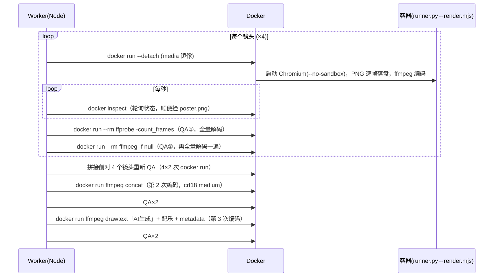
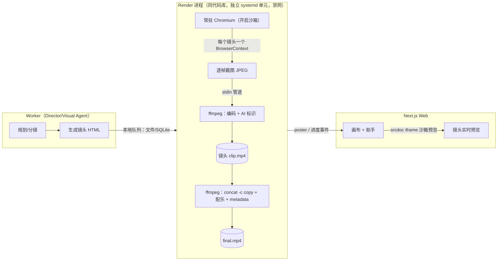
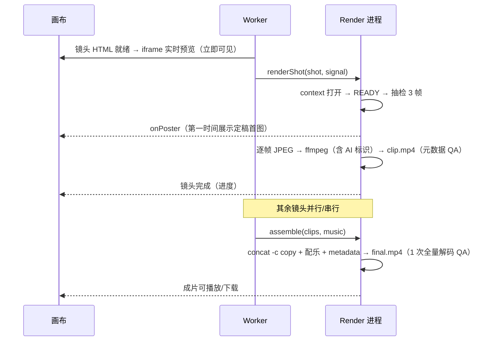

# VideoBuddy 视频 Runtime 重构技术方案：去掉 Docker 的极简出片链路

- 版本：v1.1（2026-10-10，已写入产品决策 D1–D3）
- 范围：`runtime/` 目录（media / voice / asr / storage）以及 `src/services/video` 中所有调用它的地方
- 基线代码：`main` @ `2fcdbbf`（PR #1、PR #2 合并后）
- 读者：后端、部署负责人
- 关联文档：`docs/engineering/QUICK_FLOW.md`、`docs/product/canvas-assistant-ux.md`、`deploy/README.md`
- 性质：方案与开发文档，本文不改代码

---

## 决策记录（2026-10-10，产品已拍板）

| # | 决策 | 对本方案的影响 |
|---|---|---|
| **D1** | **分步出片流程（staged：预览 → 审批 → 正式渲染）下线**，只保留一次出整片（quick） | 不再保留 docker 遗留实现，也没有过渡期。`MediaRuntime` 只做 `local` 一个实现，删除 `VIDEO_FLOW` 开关。删除与解耦清单见 §7.1 |
| **D2** | **移除语音（voice）和字幕识别（asr）镜像**，连同旁白、字幕、混音母带链路 | 删除 `runtime/voice`、`runtime/asr`、`src/services/video/audio/*` 中的语音、识别、母带部分，以及 `VIDEO_SOUND` 开关。成片声音只有曲库配乐 |
| **D3** | **先单机上线**（§10.4 路线 ①） | 按 §8 的 P0–P5 执行；Vercel 全托管（P6）暂不排期；存储仍是可选阶段 |

阶段顺序因此调整为：**先删（P1），再换渲染（P2）**。先删掉 staged 和音频链路，需要迁到本地 runtime 的调用点会从约 30 个文件减到 quick 流程和素材处理的少数几个，迁移面和回归面都会小很多。

---

## 0. 结论

1. **可以不用 Docker。**
   - Docker 在这里只解决了一个硬需求：安全、可控地运行 LLM 生成的 HTML/JS 场景，并逐帧截图。
   - 版本固定、资源限制、可取消这三件事，都有比"每一步起一个容器"便宜得多的做法。
2. **现状里 Docker 带来的代价比它提供的保护更大。**
   - 一部 4 镜头的成片要启动约 **26 次容器**（渲染 4 次，QA/拼接/合成 22 次），轮询状态还要再调用几十次 `docker inspect`。
   - 视频被**编码 3 次**：镜头、拼接、合成各一次。
   - 每个中间产物都做 **2 次全量解码** QA，一共约 20 次。
   - 容器里的 Chromium 用 `--no-sandbox` 启动，浏览器自带的沙箱是关着的。
   - Worker 必须加入 `docker` 组，而这个组在宿主机上等价于 root。
   - 开发机必须装 Docker、手动 build 镜像、抄写 digest 才能出第一条片。
3. **推荐方案 A：本机常驻 Chromium（开启沙箱）+ 系统/固定版本 ffmpeg + systemd 资源限制。**
   - 同样的 4 镜头、12 秒、1080p 成片，在 2 vCPU 上实测 **65.8 s → 21.1 s（约 3.1 倍）**。这个对比**还没计入** Docker 自身的启动和 QA 开销。
   - 拼接加配乐变成纯流拷贝，**换配乐不再重编码画面**（实测拼接 11.5 s → 0.2 s）。
   - 开发机上 `npm run dev:mvp` 加 worker 就能出片，不需要 Docker。
4. 配套简化：
   - 画布用 **iframe 沙箱实时预览**镜头场景：Agent 写完场景，用户立刻就能看到动起来，不必等服务器渲染。
   - **voice / asr 镜像和分步出片流程一并删除**（D1、D2）。
   - **Python storage 脚本换成 Node + SQLite**。这是可选的独立阶段。
5. **部署形态**：方案 A 改完后，适合部署在一台 Linux 云主机上，**不能直接部署到 Vercel**。要上 Vercel，还得把存储改到 Postgres + Blob、把 worker 改成 Workflow、把渲染放进 Vercel Sandbox，见 §10。

---

## 1. 现在的 Runtime 都做了什么

### 1.1 组件清单

| 组件 | 内容 | 依赖 | 谁在调用 | MVP quick 流程是否用到 |
|---|---|---|---|---|
| `runtime/media/Dockerfile` | node:22 + apt chromium + ffmpeg + fonts-noto-cjk + python3 + playwright 1.63 + pdfjs | Docker | 下面所有 media 调用 | ✅ |
| `media/runner.py` | 阶段控制器：stage.lock、process.json、state.json，再调起 `node render.mjs` | Python | `DockerExecutor` | ✅ |
| `media/render.mjs` | 起本地资源服务 → Chromium 打开 scene.html → 等 `READY` → 确定性抽检（3 帧各渲染 2 次比对）→ 输出 poster → **逐帧 PNG 落盘** → ffmpeg 编码为 x264 | Playwright、ffmpeg | `DockerExecutor` | ✅ |
| `media/prepare-image.mjs` | 用 Chromium 解码并规范化用户上传的图片 | Chromium | `assets/image-preparation.ts` | 有素材时用到 |
| `media/analyze-pdf.mjs` | 用 pdfjs 抽取文本层（≤100 页） | pdfjs | `assets/pdf-executor.ts`（source worker） | 上传 PDF 时用到 |
| `media/sound.py`、`master.py` | 确定性音效合成、混音母带 | Python、ffmpeg | `audio/*` | ❌（声音已关） |
| `media/book-caption*.mjs` | 绘本风格的手写字幕层 | Chromium | `media/book-caption-layer.ts` | ❌（staged） |
| `runtime/voice` | Kokoro-82M 离线 TTS，misaki[zh] 做音素化 | Docker、Python、Node、模型文件 | `audio/voice*.ts` | ❌ |
| `runtime/asr` | faster-whisper small/medium | Docker、Python、模型文件 | `audio/asr.ts`、subtitles | ❌ |
| `runtime/storage/*.py` | JSON CAS（flock + fsync）、事件日志、artifact 发布、worker lease | Python（**每次写都 spawn 一个 python 进程**） | `storage/file-store.ts`、`stream/local-event-log.ts`、`commands/worker-lease.ts`、`exports/archive-object.ts` | ✅（所有状态写入） |

Docker 调用点分布在 `src/services/video` 下约 30 个文件里：

- `media/*`
- `quick/*`
- `preview/*`
- `audio/*`
- `assets/*`
- `quality/*`
- `render/*`

### 1.2 一部 quick 成片现在是怎么出来的



**容器启动次数**（4 镜头）：

| 环节 | 次数 | 小计 |
|---|---|---|
| 镜头渲染 | 4 × (1 次渲染 + 2 次 QA) | 12 |
| 拼接 | 4 × 2 次复检 + 1 次拼接 + 2 次 QA | 11 |
| 合成 | 1 次合成 + 2 次 QA | 3 |
| **合计** | | **约 26 次** |

此外每秒还有一次 `docker inspect`。

---

## 2. 第一性原理：这件事的本质是什么

### 2.1 输入与输出

- **输入**
  - Visual Agent 生成的自包含 HTML/Canvas 场景，约定提供 `window.render(t)` 和 `window.READY`。
  - 用户素材（图片）和曲库音频。
- **输出**
  - 一个 H.264/AAC 的 MP4，带可见的「AI生成」标识和 AIGC 元数据。
  - 每个镜头要能单独重画，换配乐时画面不动。

### 2.2 不可再减的必要能力

| # | 必要能力 | 为什么不可省 |
|---|---|---|
| N1 | 执行**不可信**的 JS 并逐帧取像素 | 场景代码由 LLM 写，可能被提示注入，可能死循环、吃内存、尝试联网 |
| N2 | 编码、拼接、混音 | 交付物就是 MP4 |
| N3 | 确定性：同一时间 t 得到同一帧 | 保证镜头缓存、单镜重画和抽检有意义 |
| N4 | 资源上限与可取消 | 单个坏场景不能拖垮 worker 或机器 |
| N5 | 版本可追溯 | 运行环境变化时缓存要失效，问题要能复现 |

### 2.3 Docker 在每一项上做了什么，有没有更便宜的等价物

| 需求 | 现在用 Docker 怎么做 | 不用 Docker 的等价物 | 评价 |
|---|---|---|---|
| N1 隔离 | 容器：`--network none`、只读根、`cap-drop ALL`。**但 Chromium 是 `--no-sandbox` 启动的** | **Chromium 自带的多进程沙箱**（seccomp-bpf + namespace，就是浏览器跑任意网页 JS 时用的那套），叠加：<br>• `page.route` 只放行本地资源<br>• `--host-resolver-rules` 黑洞域名解析<br>• CSP<br>• 专用低权限用户<br>• systemd 禁网 | 隔离层数不减。Chromium 沙箱是针对"恶意 JS"这一威胁专门设计的 |
| N2 编码 | 容器里的 ffmpeg | 宿主机 ffmpeg（固定版本的静态二进制，或者系统包） | 等价 |
| N3 确定性 | 镜像 digest 固定 Chromium、字体和 ffmpeg 的版本 | `runtimeDigest = hash(Playwright 版本 + Chromium revision + ffmpeg 版本 + 字体锁 + 渲染器源码 + 编码参数)`，字体随仓库分发 | 等价（见 §5.6） |
| N4 资源 | `--cpus 4 --memory 8g --pids-limit` | systemd：`CPUQuota`、`MemoryMax`、`TasksMax`。再加单帧超时，超时就 kill 浏览器 | 等价 |
| N4 取消 | `docker stop`，靠 docker-journal 和 owned-docker 维护容器所有权 | AbortSignal 关闭 context 并 kill ffmpeg 子进程 | **更简单**，可以删掉约 3 个文件的容器簿记代码 |
| N5 追溯 | 镜像 ID | 渲染时把各组件版本写进 stage 的 manifest | 等价 |

**结论**：Docker 不是不可替代的。它只是把 N1–N5 打包在一个重型机制里，代价是启动开销、部署复杂度、root 等价的权限组，以及关掉了浏览器自带的沙箱。

---

## 3. 现状的代价

### 3.1 性能：本仓库环境实测

测试条件：

- 2 vCPU / 7 GB 内存，headless Chromium，ffmpeg 6.1。
- 场景是 1920×1080 的 Canvas，每帧画 1500 条线、一个圆和中文字。
- 4 个镜头 × 72 帧（24 fps，共 12 s）。
- 两条链路的帧数都校验为 288 帧。
- **注意：这个环境没有 Docker daemon，"现状"一栏没有计入容器启动、`docker inspect` 轮询和 QA 的 20 次解码，真实差距会更大。**

| 阶段 | 现状链路（照 render.mjs / picture-sequence / compose 复刻） | 方案 A |
|---|---|---|
| 镜头（截图 + 编码） | 43.5 s，其中截图 29.5 s（PNG 落盘，每镜新启浏览器） | 20.9 s（同一浏览器、JPEG q92 经管道送入 ffmpeg、标识在此叠加） |
| 拼接 | 11.5 s（concat filter 重编码 crf18 medium） | — |
| 配乐 + 标识 | 10.7 s（drawtext 重编码） | 0.2 s（concat demuxer `-c copy` + 音频 + metadata） |
| **合计** | **65.8 s** | **21.1 s** |

单项测量：

- 截图：PNG 约 114 ms/帧，JPEG 约 62 ms/帧。
- QA 解码：一个 3 s 镜头 `ffprobe -count_frames` 0.39 s，再 `ffmpeg -f null` 0.30 s；12 s 成片分别是 1.26 s 和 0.99 s。现状有 10 个产物各做 2 次，加起来约 7–8 s，还要再加 20 次容器启动。
- 浏览器内 WebCodecs：本环境的 headless Chromium 不提供 `VideoEncoder`，方案 B 的服务端变体不成立（见 §4）。

说明：方案 A 测试用的是 `-preset veryfast -crf 18`，体积比现状大（12 s 分别是 6.7 MB 和 2.3 MB）。编码参数需要在 P0 里统一调优（建议 `-preset faster -crf 20` 起步）。**结构性收益来自两点，与 preset 无关**：去掉 2 次重编码；不再 PNG 落盘、不再每镜重启浏览器。

### 3.2 结构性代价

1. **3 代编码**：画质每一代都有损失，时间也翻倍。换配乐会触发 drawtext 重编码整片，和 UI 上"换配乐只重新混音，不会重画画面"的承诺不一致：画面确实没重画，但重编码了。
2. **QA 重复**：`ffprobe -count_frames` 本身已经全量解码过一次，后面的 `ffmpeg -f null` 是重复的；拼接前还对已经通过 QA 的镜头再查一遍。
3. **权限**：deploy/README 已经写明，worker 需要 `docker` 组，这是"privileged host capability"。worker 一旦被攻破就等于宿主机 root。
4. **运维和上手**：
   - 需要 build 镜像、抄 `VIDEO_MEDIA_IMAGE_REF` 和 `VIDEO_MEDIA_RUNTIME_DIGEST`。
   - voice/asr 还要再拉模型、build 两个镜像、再抄 4 个变量。
   - 社区用户第一次运行的门槛很高。
5. **Python 依赖**：每次状态写入都 spawn 一个 python 进程（`file-store.ts` → `state_store.py`）。MVP 已经没有其他 Python 需求，这是唯一把 Python 留在宿主机上的理由。
6. **死重**：voice/asr 镜像和模型在 MVP 默认配置下完全不用。

---

## 4. 方案对比

| | **A. 本机常驻 Chromium + ffmpeg（推荐）** | B. 浏览器端导出（WebCodecs） | C. 保留 Docker，改为常驻渲染服务 | D. 第三方渲染云 |
|---|---|---|---|---|
| 做法 | Worker（或独立的 render 进程）启动一个开启沙箱的 Chromium，每个镜头用一个 context，帧经管道送进 ffmpeg | 用户浏览器里跑场景，WebCodecs 编码，mp4-muxer 封装，上传或直接下载 | 一个长驻容器提供 HTTP/队列接口，内部复用浏览器 | 把场景交给外部服务渲染 |
| 部署依赖 | Node、Playwright Chromium、ffmpeg | 无服务端渲染 | Docker | 账号与费用 |
| 速度 | 快（实测 3×+） | 取决于用户设备 | 中（省掉启动开销，但仍是容器链路） | 快但有网络往返 |
| 隔离 | Chromium 沙箱 + 进程级限制 | 用户自己的浏览器（iframe 沙箱） | 容器 + 可开启的 Chromium 沙箱 | 由对方负责 |
| 一致性 | 服务端统一，可追溯 | **设备差异大**，Safari/Firefox 的 H.264 编码支持参差（需按目标浏览器实测），手机端发热和后台挂起 | 统一 | 统一 |
| 合规（AI 标识、元数据） | 服务端强制 | 客户端可被绕过 | 服务端强制 | 依赖对方 |
| 代码量变化 | **删多加少** | 新增一大块前端编码和音频逻辑 | 改动中等，Docker 仍在 | 新增集成，引入厂商锁定 |
| 结论 | ✅ 采用 | 只用于**预览**，不作为最终导出 | 作为"需要更强隔离时"的升级路线 | ❌ |

> 方案 B 的预览部分（iframe 沙箱实时播放场景）与方案 A **互补**，一并纳入（§5.8）。

---

## 5. 推荐方案详细设计

### 5.1 目标架构



- **MediaRuntime 接口**：在 `src/services/video/media/runtime.ts` 定义 `renderShot / assemble / probe / prepareImage`。
  - 目前只有 `local` 一个实现（D1：不保留 docker 遗留实现）。
  - 保留这个接口，是为了将来上 Vercel 时能加一个 `sandbox` 实现（§10.3），业务代码不用改。
- **进程形态**：
  - 开发机：render 直接在 worker 进程内运行，零配置。
  - 生产：独立的 `videobuddy-render` systemd 单元，网络全禁（§5.5）。
  - 两者走同一份代码，只是入口不同（`npm run worker` 和 `npm run worker:render`）。

### 5.2 镜头渲染 `LocalRenderer.renderShot`

渲染器逻辑沿用 render.mjs，只改"怎么跑"，不改"跑什么"。

1. **浏览器池**：每个 render 进程常驻 1 个 Chromium。
   - 启动参数：`chromium.launch({chromiumSandbox:true, args:[…]})`。**Playwright 默认 `chromiumSandbox:false`，必须显式开启。**
   - 每渲染 N 个镜头（建议 50）或崩溃后重启一次。
2. **每个镜头一个 `BrowserContext`**：
   - viewport 为逻辑分辨率，`deviceScaleFactor:1`，`serviceWorkers:'block'`，`acceptDownloads:false`，不授予任何权限。
3. **资源服务**：沿用 `runtime-assets.mjs` 的本地资源服务（只监听 127.0.0.1、只服务白名单资源）。`context.route('**/*')` 只放行本服务的 origin，其他请求一律 abort 并记日志。
4. **注入 CSP**：服务 `scene.html` 时加响应头
   `default-src 'none'; script-src 'unsafe-inline'; style-src 'unsafe-inline' <origin>; img-src <origin> data: blob:; font-src <origin>; connect-src 'none'; frame-src 'none'; form-action 'none'`。
5. **等待就绪**：`READY === true`（30 s 超时）并等到 `document.fonts.ready`。
6. **确定性抽检**：保留现有逻辑，首、中、尾 3 帧各渲染 2 次逐字节比对，不一致就报 `NONDETERMINISTIC_SCENE`。中间帧直接通过回调 `onPoster(buffer)` 交给上层，不再落盘后靠轮询去捡。
7. **逐帧**：`render(t)` 后 `page.screenshot({type:'jpeg', quality:92})`，写入 ffmpeg stdin，并处理背压（等待 `drain`）。
   - 单帧超时（建议 5 s）用 `Promise.race` 实现，超时就 `browser.close()`（强制 kill），镜头记为 `RENDER_FRAME_TIMEOUT`。
   - 可选优化（P0 测一下再决定）：CDP `Page.captureScreenshot` 带 `optimizeForSpeed:true`；或约定场景只用单个 canvas，直接取像素。
8. **编码**（每个镜头一个 ffmpeg 进程）：
   ```
   ffmpeg -f image2pipe -c:v mjpeg -framerate {fps} -i - \
     -vf "scale={W}:{H}:flags=lanczos,drawtext=fontfile={仓库字体}:text=AI生成:…" \
     -c:v libx264 -preset faster -crf 20 -g {fps*2} -pix_fmt yuv420p \
     -color_primaries bt709 -color_trc bt709 -colorspace bt709 \
     -movflags +faststart -frames:v {帧数} clip.mp4
   ```
   - **「AI生成」标识在这一步叠加**，所以每一帧都带标识。由 ffmpeg 叠加而不是在页面 DOM 里叠加，因为不可信的场景 JS 可以删掉 DOM 元素。
   - 所有镜头的编码参数完全一致，保证后面可以 `-c copy` 拼接。
9. **原子发布**：先写 `clip.mp4.partial`，QA 通过后 `rename` 成 `clip.mp4`。stage key 仍然是内容寻址（`computeStageKey` 不变，只是 `runtimeDigest` 的来源变了），缓存命中逻辑不变。
10. **并行**：`min(镜头数, floor(CPU 核数 / 2))` 个 context 同时渲染。2 vCPU 时为 1，8 vCPU 时为 4。

### 5.3 拼接、配乐、元数据 `assemble`

一条命令，画面不重编码：

```
ffmpeg -f concat -safe 0 -i list.txt [-stream_loop -1 -i music.m4a | -f lavfi -i anullsrc=r=48000:cl=stereo] \
  -map 0:v -c:v copy \
  -filter_complex "[1:a]atrim=0:{d},asetpts=N/SR/TB,afade=in…,afade=out…,loudnorm=I=-16:TP=-1.5:LRA=11,aresample=48000[a]" -map "[a]" \
  -c:a aac -b:a 192k -ac 2 -t {d} \
  -metadata title=… -metadata comment="AIGC: generated by VideoBuddy" -metadata aigc=… \
  -movflags +faststart+use_metadata_tags final.mp4
```

- 音频滤镜照搬现有的 `quick/compose.ts`。
- **换配乐**只重跑这一步，实测秒级。
- **重画一镜**：只重跑该镜头的 `renderShot`，再跑一次 `assemble`。
- `picture-sequence.ts` 的 concat filter 重编码不再使用，随 docker 实现一起删除（§7.1）。

### 5.4 QA `probe`

| 产物 | 检查 | 解码次数 |
|---|---|---|
| 镜头 clip | 文件签名、faststart atom 顺序（沿用 `assertMp4Faststart`），`ffprobe -show_entries stream=…,nb_frames`（读容器字段，**不解码**） | 0 |
| 成片 final | 上面这些，加上 `ffprobe -count_frames` 一次全量解码。帧数、分辨率、色彩、音轨、时长全部校验（沿用 `validateVideoProbe`） | 1 |

- 删除重复的 `ffmpeg -f null` 解码，以及拼接前对镜头的复检。镜头内容由 sha256 保证，不变就不用再查。
- 总解码次数从约 20 次降到 1 次。

### 5.5 安全模型（不使用 Docker）

威胁是：提示注入导致场景 JS 恶意，或者场景 JS 有严重 bug。分五层防御：

| 层 | 措施 | 防什么 |
|---|---|---|
| L1 内容 | 保留现有的场景 HTML 校验与大小上限；服务时注入 CSP（§5.2-4） | 外链脚本、联网、表单、嵌套 frame |
| L2 浏览器 | **开启 Chromium 沙箱**；`context.route` 白名单；`--host-resolver-rules="MAP * ~NOTFOUND, EXCLUDE 127.0.0.1"`；`--force-webrtc-ip-handling-policy=disable_non_proxied_udp`；禁 Service Worker、下载和权限；`--js-flags=--max-old-space-size=1024` | 渲染进程被利用、数据外传、内存炸弹 |
| L3 进程 | 专用用户 `videobuddy-render`，对代码目录只读，只对 `media/` 可写；单帧超时 + 单镜头总超时 → kill 浏览器和 ffmpeg | 死循环、卡死 |
| L4 系统（systemd 单元） | `MemoryMax=6G`、`CPUQuota=…`、`TasksMax=256`、`IPAddressDeny=any`、`IPAddressAllow=localhost`、`ProtectSystem=strict`、`ReadWritePaths=/var/lib/videobuddy/media`、`ProtectHome=yes`、`PrivateTmp=yes`、`NoNewPrivileges=yes`。**不要设置** `RestrictNamespaces`，Chromium 沙箱需要 user namespace | 资源耗尽、联网、横向写文件 |
| L5 权限 | **任何服务都不再需要 `docker` 组** | 消除 root 等价的权限面 |

与现状对比，攻击者需要突破的层次：

- **现状**：渲染进程（无沙箱）→ 容器（seccomp/cap-drop）→ 内核。
- **方案 A**：渲染进程 → Chromium 沙箱 → systemd/用户隔离 → 内核。

两者层数相当。前者的强项是 mount namespace，后者的强项是专门针对恶意 JS 的浏览器沙箱。

**升级路线**：如果将来开放给大量陌生用户（多租户、大规模），且评估认为需要更强隔离，就把 render 单元整体放进 gVisor 或 Firecracker 这类 microVM，或者回到方案 C。**接口不变，只换进程托管方式**，业务代码不受影响。

### 5.6 版本固定与确定性

- **Chromium**：使用 Playwright 自带的 Chromium（版本由 `package-lock.json` 里的 playwright 版本锁定），部署时执行 `npx playwright install chromium`。不再使用 apt 的 chromium。
- **ffmpeg**：二选一。
  - 固定版本的静态二进制，在 `runtime/ffmpeg.lock.json` 里记录 URL 和 sha256，由 `doctor` 校验。
  - 系统 ffmpeg ≥ 6.0，版本字符串计入 digest。
  - MVP 建议先用系统包，社区版的安装文档最简单。
- **字体**：仓库已有 `fonts.lock.json`。把场景用到的字体（Noto Sans CJK 子集、Ma Shan Zheng、Patrick Hand 等）放进 `runtime/fonts/`：
  - 资源服务通过 `@font-face` 提供给场景，场景不依赖系统字体。
  - drawtext 标识也使用这里的字体。
- **runtimeDigest**（新增 `media/runtime-version.ts`）：
  ```
  sha256(JSON{ playwright: 版本, chromium: browser.version(), ffmpeg: `ffmpeg -version` 首行,
               fonts: fonts.lock.json 的 hash, renderer: renderShot/assemble 源码 hash, encoder: 编码参数 })
  ```
  - 进程启动时计算一次，写进每个 stage 的 `manifest.json`。
  - 任何组件升级都会自动让缓存失效。不追求跨机器逐字节一致，只要求同一个 digest 内可复现。

### 5.7 取消、超时、崩溃恢复

- 上层 `assertActive()` 改成 `AbortSignal`。`renderShot` 和 `assemble` 收到 abort 后关闭 context 并 kill ffmpeg。
- render 进程崩溃时：`.partial` 文件不会被发布，重启后按 stage key 重新渲染。现有的 operation 队列和 lease 机制不变。
- 删除 `docker-journal.ts`、`owned-docker.ts`、容器命名和簿记，以及 `runner.py`。阶段锁改用进程内互斥加 stage 目录的原子 rename。

### 5.8 画布实时预览（配合交互方案 `docs/product/canvas-assistant-ux.md`）

- Visual Agent 写完某个镜头的 HTML 后，前端直接在画布的镜头卡片里播放：
  - `<iframe sandbox="allow-scripts" srcdoc="…">`。**不加** `allow-same-origin`，iframe 是不透明源，拿不到 cookie，也碰不到父页面。
  - srcdoc 头部注入与 §5.2-4 相同的 CSP meta，`connect-src 'none'`。
  - 父页面用 `postMessage` 驱动 `render(t)`（播放、暂停、拖动进度）。
- 用户等待时就能看到镜头动起来。服务器渲染只负责出"定稿"，体感延迟从"等渲染"变成"几乎为零"。
- 预览只播放，不导出。最终文件仍然以服务端为准，保证标识、元数据和一致性。

### 5.9 其他 runtime 组件的处置

| 组件 | 处置 |
|---|---|
| `prepare-image.mjs` | 复用 render 进程里的 Chromium（单独一个 context 解码并规范化），**不引入新依赖** |
| `analyze-pdf.mjs` | 改在 Node `worker_threads` 里运行 pdfjs-dist，设置 `resourceLimits`（如 512 MB）、单文件超时、≤100 页，并设置 `isEvalSupported:false`（规避 CVE-2024-4367 一类问题）。source worker 不再需要 Docker |
| `sound.py`、`master.py`、`book-caption*` | **删除**（D1、D2）。配乐的响度归一和淡入淡出已经在 assemble 的 ffmpeg 滤镜里完成 |
| `runtime/voice`、`runtime/asr` | **删除**（D2，git 历史可追回）。将来恢复旁白时，优先选**返回逐字时间戳的云端 TTS**，这样字幕对齐就不需要 ASR。若坚持离线，同样用"本机进程"模式，不再用 Docker |
| `runtime/storage/*.py` | 见 §5.10 |

### 5.10 存储：Python flock → Node + SQLite（独立阶段，可选）

- 现状：每次状态写入都 spawn 一次 python 来做 flock CAS，正确但很重，也是 MVP 唯一还需要 Python 的地方。
- 方案：用一个 `state.db`（SQLite，WAL 模式，`busy_timeout`），建三张表：
  - `kv(key PRIMARY KEY, version, value JSON)`：实现 CAS，接口保持 `AtomicStore` 不变。
  - `events(seq AUTOINCREMENT, project, payload)`：替代 `event_log.py`，SSE 按 seq 续传。
  - `leases(name, holder, expires_at)`：替代 `worker_lease.py`。
- 媒体文件仍然放文件系统。`artifact_object.py` 的发布逻辑用 Node 的 `rename` 和 `fsync` 重写。
- 驱动选型：
  - `better-sqlite3`：成熟，需要在 next.config 的 `serverExternalPackages` 中声明。
  - Node 内置 `node:sqlite`：零依赖，但在 Node 22 上仍会打印 ExperimentalWarning（本环境 v22.22 实测如此）。
  - 建议先用 `better-sqlite3`。
- 迁移：写一次性脚本 `scripts/video/migrate-store.ts`，把现有 JSON 导入。可以先双写一个版本再切换。

---

## 6. 新的出片流程



**时延估算**（4 镜头、12 s、1080p，按 2 vCPU 实测外推）：

| 阶段 | 现状 | 方案 A |
|---|---|---|
| 镜头渲染 | ≈ 44 s + 每镜容器启动 + QA | ≈ 21 s |
| 拼接 | ≈ 12 s + QA | — |
| 合成 | ≈ 11 s + QA | ≈ 0.2 s + 1 次 QA（约 1.3 s） |
| 换配乐 | ≈ 11 s + QA | ≈ 1.5 s |
| 用户看到第一个镜头动起来 | 第一个镜头渲染完 | 场景 HTML 生成完就能看到 |

---

## 7. 代码改动清单

### 新增
- `src/services/video/media/runtime.ts`：`MediaRuntime` 接口（目前只有 local 实现）。
- `src/services/video/media/local/renderer.ts`：浏览器池和 `renderShot`，逻辑由 `runtime/media/render.mjs` 迁移而来。
- `src/services/video/media/local/ffmpeg.ts`：解析 ffmpeg 和 ffprobe 路径，`run(args, {signal, stdin, timeout})`。
- `src/services/video/media/local/assemble.ts`：§5.3 的命令。
- `src/services/video/media/local/probe.ts`：§5.4，复用 `validateVideoProbe` 和 `assertMp4Faststart`。
- `src/services/video/media/runtime-version.ts`：计算 runtimeDigest。
- `scripts/video/render-worker.ts`，以及 `package.json` 的 `worker:render` 脚本。
- `deploy/videobuddy-render.service`：§5.5 的 L4 配置。
- `runtime/fonts/` 与资源服务的 `@font-face` 注入。
- `src/components/video-studio/shot-preview.tsx`：§5.8 的 iframe 预览，配合 canvas 组件使用。
- `tests/video/local-runtime.test.ts`：§8 的安全和功能用例。

### 修改
- `src/services/video/quick/film.ts`：
  - 把 `DockerExecutor`、轮询循环和 `savePoster` 轮询替换为 `await runtime.renderShot(job, {signal, onPoster})`。
  - 把 `assemblePictureSequence` 加 `composeQuickFilm` 替换为 `runtime.assemble(...)`。
- `src/services/video/quick/compose.ts`：
  - 标识移到镜头编码阶段；`aiLabel.font` 改为指向仓库字体。
  - `quickComposeKey` 加入新的版本号。
- `src/services/video/media/technical-qa.ts`：改为调用本地 ffprobe，并去掉重复解码。
- `src/services/video/assets/image-preparation.ts`、`pdf-executor.ts`：改走 local runtime 或 worker_threads。
- `scripts/video/doctor.ts`：新增检查项：
  - Chromium 能否以沙箱模式启动。如果失败，提示 AppArmor/userns 的处理办法。
  - ffmpeg 和 ffprobe 的版本。
  - 字体文件是否齐全。
  - 输出 runtimeDigest。
- `README.md`、`deploy/README.md`、`.env.example`：删除 build 镜像和 digest 的步骤；默认安装只需要 `npm ci && npx playwright install chromium && apt install ffmpeg`。

### 删除（P2 完成、本地 runtime 接管后）
- `media/docker-executor.ts`、`owned-docker.ts`、`docker-journal.ts`、`picture-sequence.ts`、`runtime-asset-image.ts`。
- `runtime/media/Dockerfile`、`runner.py`、`test_runner.py`、`package*.json`；其中 `render.mjs`、`runtime-assets.mjs`、`prepare-image.mjs`、`analyze-pdf.mjs` 的逻辑已迁入 `src/services/video/media/local/`。
- 环境变量 `VIDEO_MEDIA_IMAGE_REF`、`VIDEO_MEDIA_RUNTIME_DIGEST`。
- P5（存储）完成后，删除 `runtime/storage/*.py`。

### 7.1 分步流程与音频链路下线：删除与解耦清单（P1）

下面的清单由 esbuild 依赖图分析得出，基线是 `main@2fcdbbf`。分析方法：

- **保留入口**：除 `preview/approve` 外的全部 API 路由和页面，`scripts/video/worker.ts`（已切断 staged 分支），`scripts/video/source-worker.ts`。
- **staged 入口**：`commands/local-preview.ts`、`commands/local-render.ts`、`preview/approve/route.ts`。
- 用前者能到达的模块和后者能到达的模块做差集。

**A. 可直接删除（31 个文件，约 220 KB 源码，只被 staged 链路引用）**

```
src/app/api/video/projects/[projectId]/preview/approve/route.ts
src/services/video/commands/local-preview.ts
src/services/video/commands/local-render.ts
src/services/video/domain/preview-policy.ts
src/mastra/video/audio-plan.ts
src/mastra/video/content-requirements.ts
src/services/video/audio/{master,mix,narration,voice}.ts
src/services/video/preview/{approve,artifact,audio-execution-stage,audio-plan-stage,composite-journal,
  composite-stage,content-requirements-stage,excerpt-stage,film-package-stage,narration-package-stage,
  picture-sequence-stage,picture-stage,pipeline,publish,select-excerpt,timing-stage,treatment-stage,
  visual-stage,voice-stage}.ts
src/services/video/quality/{composite-binding,visual-review-stage}.ts
```

另外要同步处理：

- `scripts/video/worker.ts` 里的 `runPreviewOperation`、`runApprovedRenderOperation` 两个分支，以及 `quickFlow()` 判断（改为 preview 任务一律走 quick）。
- 约 35 个 staged 或音频相关的 probe 脚本（`probe-{asr*,voice*,book-*,clear-*,frozen-preview,reviewed-*,preview-*,composition,subtitles,source-audio,new-theme}.ts` 等），以及 `package.json` 里对应的 `probe:video:*` 脚本。
- `tests/video/` 中约 64 个引用了 preview、render、audio 或 docker 的测试文件。逐个判断：只覆盖 staged 的删除，覆盖共享逻辑的改写。

**B. 必须先解耦，才能继续删除（核心代码 → staged 或音频模块的 import）**

这些边让 `preview/*`、`render/*`、`audio/*` 中另外约 50 个文件仍然"看起来被用到"。每一处都要把 quick 真正需要的那一小部分**搬到中性位置**，或者**直接去掉**：

| 解耦点 | 现在依赖 | 处理 |
|---|---|---|
| `results/publish.ts` | `render/mvp-publication`、`render/content-review`、`preview/commit`、`quality/publish-gate`、`quality/delivery` | quick 成片发布只需要"校验 final.mp4 → 写结果清单 → 发布 artifact"。新写一个精简的 `results/publish-film.ts`，`render/*` 随后整体删除 |
| `preview/route.ts` → `preview/prepare.ts` → `frozen-preview` → `contracts/video/film-package` → `timeline/package`、`audio/execution-package` | staged 的冻结预览包 | 改由 quick route 直接入队（保留 `/preview` 路径，只作为兼容别名）。`prepare.ts` 只留 quick 用到的操作创建逻辑；`film-package`、`timeline/package`、`frozen-preview` 删除 |
| `storage/project-store.ts` | `preview/action`、`preview/commit`、`quality/delivery` | ProjectView 去掉审批和预览相关字段；`mvpProfile` 和时长上限移到 `config/profile.ts` |
| `mastra/video/director.ts`、`styles/route.ts` | `quality/delivery`（`soundEnabled`、`mvpProfile`） | 同上，改为引用 `config/profile.ts`；删除 `musicInstructions` 和有声相关的提示词分支 |
| `mastra/video/visual-shot.ts`、`contracts/video/visual-shot.ts` | `preview/timing-draft`、`audio/book-font` | 把用到的时间轴工具函数和字体常量移到 `quick/` 或 `domain/` |
| `quick/film.ts` | `preview/fence` | 把 `fence` 移到 `commands/` 或 `domain/` |
| `commands/local-director.ts`、`assets/image-analysis-stage.ts`、`contracts/video/content-requirements-proof.ts` | `audio/narration-package` | 只引用了旁白相关的类型或校验，删除这些引用；director 去掉旁白修订分支 |
| `commands/local-director.ts` → `revisions/music-change-plan` → `revisions/music-gain` | `audio/execution-package`、`contracts/video/audio-plan` | staged 的"调音乐音量"修订，删除。quick 的换配乐走 `quick/settings` |
| `contracts/video/content-review.ts` | `audio/recognition-policy` | 去掉语音识别相关字段 |
| `exports/{documents,poster,publication,source-archive,operation}.ts` | `preview/package`、`preview/commit`、`audio/*`、`quality/visual-evidence` | 导出只保留"成片 MP4 + 封面图"，删除源包或旁白归档导出（`source-archive`、`source-zip`、`documents`） |
| `assets/audio-executor.ts`（source worker） | `audio/asr`、`audio/wav`、`docker-executor` | 上传音频素材的转写随 ASR 一起删除。前端上传入口目前只接受 `.md/.pdf`，资源预留接口同步拒绝 audio MIME |
| `timeline/package.ts` | `media/book-caption-layer`、`audio/book-font` | 随 film-package 一起删除 |

**C. 配置与界面**

- 删除环境变量：`VIDEO_FLOW`、`VIDEO_SOUND`、`VIDEO_VOICE_*`、`VIDEO_ASR_*`。是否保留 `VIDEO_DELIVERY_PROFILE`，取决于 `full` 档还有没有含义；建议删除，统一使用 MVP 档的约束。
- `src/components/video-studio/canvas/Canvas.tsx` 中的审批和预览分支，以及 `contracts/video/project.ts` 里的 `phase` 等相关状态，同步收敛。
- README、`deploy/README.md`、`.env.local.example`、`docs/engineering/QUICK_FLOW.md` 中关于 staged、voice、asr 的说明同步删除。
- **存量数据**：已有项目里处于"待审批"状态的预览，下线后无法继续。上线前跑一次迁移脚本，把这类项目的状态重置为"可重新生成"，并在画布上提示一句。

**P1 验收**：

- 用同样的方法重跑依赖图：`preview/*`、`render/*`、`audio/*` 只剩被 quick 实际使用并已经迁走的文件，其余目录为空或已删除。
- `npm run typecheck`、`npm run lint`、`npm test` 全部通过。
- 现有 quick-flow 测试不变且通过；本地用 Docker 实现仍能出整片（此时渲染还没切换）。

---

## 8. 迁移计划与验收标准

| 阶段 | 内容 | 预估 | 验收 |
|---|---|---|---|
| **P0 基准** | 用一个固定的 4 镜头样例同时跑 docker 链路和 local 链路，比较帧数、时长、SSIM（≥0.99）、体积和耗时；确定 preset 和 crf | 0.5 d | 出对照报告；local 链路耗时 ≤ docker 链路的 50% |
| **P1 下线 staged 与音频** | 按 §7.1 执行 A、B、C 三部分；删除 `runtime/voice`、`runtime/asr` | 3–4 d | 见 §7.1 的 P1 验收 |
| **P2 本地渲染** | `MediaRuntime`、`LocalRenderer`、ffmpeg 封装、本地 QA；quick 流程接入；删除 docker 实现和 `runtime/media` 镜像 | 2–3 d | **没装 Docker 的机器上**，`npm run dev:mvp` 加 `npm run worker:mvp` 能出整片；现有 quick-flow 测试全部通过；`grep -ri docker src scripts` 无结果 |
| **P3 合成与预览** | 标识前移、`concat -c copy`、换配乐只跑 assemble；画布 iframe 预览 | 1–2 d | 换配乐不触发视频编码（日志可证明）；单镜重画只渲染这一镜；预览 iframe 访问 `parent` 或 `fetch` 失败 |
| **P4 单机部署** | render systemd 单元、专用用户、doctor 检查；文档 | 1 d | 在 Ubuntu 24.04 上 doctor 全部通过；`systemctl show` 能看到限额；worker 不在 `docker` 组里 |
| **P5 存储（可选）** | SQLite 替换 Python storage | 2–3 d | 并发写测试（web + 2 个 worker）无丢失、无冲突；宿主机不再需要 Python |

上线门槛是 P0–P4，合计约 **8–11 个工作日**；P5 可以上线后再做。

**安全与健壮性测试用例**（放进 `tests/video/local-runtime.test.ts`，在 P2/P4 通过）：

1. 场景里 `fetch('https://example.com')`、`new Image().src=外链`、`WebSocket`、`location.href=外链` 都被拦截；渲染要么正常完成（请求被拦），要么报 `RESOURCE_BLOCKED`；外部无任何访问。
2. `render` 里写 `while(true){}`：单帧超时后报 `RENDER_FRAME_TIMEOUT`，浏览器被重启，下一个任务正常。
3. 内存炸弹（不断分配大数组）：被 V8 堆上限或 cgroup 终止，worker 存活，报错可读。
4. `Math.random()` 驱动的场景：报 `NONDETERMINISTIC_SCENE`。
5. 场景尝试删除或覆盖页面元素：成片上仍然有「AI生成」标识（标识由 ffmpeg 叠加）。
6. 取消操作：2 s 内 Chromium context 和 ffmpeg 进程全部退出，没有残留 `.partial` 发布。
7. 成片 `ffprobe`：h264/yuv420p/bt709、AAC 48k 立体声、帧数精确、faststart、带 AIGC 元数据。

---

## 9. 风险与待决问题

| # | 风险或问题 | 应对 |
|---|---|---|
| R1 | **Chromium 沙箱启动依赖 unprivileged user namespace**。Ubuntu 23.10+ 默认用 AppArmor 限制它（`kernel.apparmor_restrict_unprivileged_userns=1`），以 root 运行也会失败（本环境以 root 测试时报 "Chromium sandboxing failed!"） | 以非 root 用户运行，并为 Playwright 的 Chromium 路径加一个 AppArmor profile（`userns,`），或使用 Chromium 自带的 setuid `chrome-sandbox`。doctor 检测并给出命令。**不允许**静默降级为 `--no-sandbox`；只允许开发环境显式设置 `VIDEO_UNSAFE_NO_SANDBOX=1`，并在界面上标红 |
| R2 | 跨机器像素不完全一致（CPU 架构、Skia 版本） | runtimeDigest 进入缓存 key，不同机器不会误命中；验收只看同一 digest 内可复现 |
| R3 | 多租户大规模开放时，隔离强度可能不够 | 接口不变，render 单元可以整体迁入 gVisor 或 microVM（§5.5 升级路线）；同时做排队和每用户配额 |
| R4 | ~~staged 流程的去留~~ | **已决策（D1）：下线**。剩余风险是存量的待审批项目，处理见 §7.1 C |
| R5 | JPEG 中间帧带来的画质损失 | q92 加 x264 crf20 肉眼不可见。P0 用 SSIM 验证；不达标就改为 PNG 管道（约 114 ms/帧）或 CDP `optimizeForSpeed` |
| R6 | 体积变大（preset 更快） | P0 调 preset 和 crf，目标是体积 ≤ 现状的 1.3 倍 |
| R7 | 有人仍然想用 Docker 部署整个应用 | 完全可以把**整个应用**打成一个镜像（web + worker + render 同镜像，容器内用非 root 用户，并通过 seccomp profile 允许 Chromium 沙箱）。区别在于：不再需要从 worker 去调用 Docker，不需要 docker.sock，也不需要 docker-in-docker |

---

## 10. 部署形态（含 Vercel）

### 10.1 结论：方案 A 改完后**不能直接**部署到 Vercel

去掉 Docker 只解决了"渲染怎么跑"。项目里还有几处假设"有一台常驻的服务器"，和 Docker 无关：

| # | 现状假设 | Vercel 上的情况 | 必须的改造 |
|---|---|---|---|
| V1 | 状态 JSON、上传素材、渲染产物、曲库都在**本地磁盘**（`VIDEO_*_ROOT`、`VIDEO_MUSIC_DIR`），写入靠 Python flock | 函数没有持久磁盘，只有每个实例各自的临时 `/tmp` | 状态、事件、租约改用 **Postgres**（如 Neon，通过 Vercel Marketplace 接入），媒体和曲库改用 **Vercel Blob**。§5.10 的存储阶段从"可选"变为**必做**，且目标是 Postgres，不是 SQLite 文件 |
| V2 | `npm run worker` **常驻进程**轮询本地队列；SSE 读本地事件日志 | 没有常驻进程，函数有最长执行时间 | 用 **Vercel Workflow**（多步骤、可重试、持久化状态）编排：规划 → 分镜 → 渲染 → 合成。SSE 改为从 Postgres 按 seq 读取，前端已有断线重连 |
| V3 | 上传走 API 路由 | 函数请求体和响应体上限 **4.5 MB** | 图片、PDF、音乐改为**浏览器直传 Blob**（client upload + 服务端签发 token），成片下载走 Blob URL |
| V4 | 渲染在 worker 内运行，开启 Chromium 沙箱 | 见 10.2 | 渲染放进 **Vercel Sandbox** |

### 10.2 为什么渲染不能放在普通 Vercel Function 里

- **规格**：Pro 计划的函数最多 2 vCPU / 4 GB，最长 800 s（1800 s 为 Beta）；Hobby 为 1 vCPU / 2 GB，最长 300 s。Chromium 加 ffmpeg 超过 250 MB 的标准包体上限，需要 Large Functions（Beta，最大 5 GB）。这些都还能凑合。
- **安全，这是决定性原因**：
  - 函数环境里开不了 Chromium 沙箱（缺少 user namespace），只能 `--no-sandbox`。
  - Fluid compute 下，同一个实例会**并发处理其他请求**，环境变量里有模型 API Key、数据库和 Blob 凭据。
  - 结果就是把 LLM 生成的 JS 放在密钥旁边裸跑，正好违背 §5.5 的前提。

### 10.3 Vercel 上的渲染：Vercel Sandbox

Vercel Sandbox 是给不可信代码用的 Firecracker microVM，每部片子一台，隔离强度高于 §5.5 的方案 A。

| | Hobby | Pro |
|---|---|---|
| 单个 Sandbox 规格 | ≤ 4 vCPU / 8 GB | ≤ 8 vCPU / 16 GB |
| 单次会话最长 | 45 分钟 | 24 小时 |
| 并发 | 10 | 10 000 |
| 计费 | 每月含 5 小时 Active CPU、420 GB·h 内存，超出后暂停 | Active CPU $0.128/h、内存 $0.0212/GB·h（iad1 区域，内存按 1 分钟起计） |

设计要点：

1. **镜像**：基于 Sandbox 的 Ubuntu 托管镜像，预装 Playwright Chromium、ffmpeg 和 `runtime/fonts`，做成快照（或自定义镜像）。runtimeDigest 取快照内的组件版本，规则同 §5.6。
2. **粒度**：**一部片子一个 Sandbox**。所有镜头渲染加 assemble 都在里面完成，避免每个镜头都创建一次 Sandbox。
3. **零密钥**：
   - Sandbox 里不放任何凭据。Workflow 步骤通过 Sandbox SDK 写入 `scene.html`、job 和素材，执行渲染命令，再**由外部步骤读出**成片和 poster，上传到 Blob。
   - 是否能对 Sandbox 设置出网白名单或禁网，接入前需要按 Vercel 当前文档确认。若不支持，就依靠 §5.2 的 route 拦截、CSP 和 DNS 黑洞，并且保证里面没有任何值得外传的数据。
4. **复用接口**：新增 `MediaRuntime` 的第三个实现 `sandbox`（`VIDEO_MEDIA_RUNTIME=local|sandbox`），内部仍然调用同一份 `renderShot`/`assemble` 脚本。**渲染逻辑不重写**，只换托管方式。
5. **单片成本粗估**（4 镜头、12 s、1080p，2 vCPU / 4 GB，墙钟约 45 s，Active CPU 约 80 vCPU·s）：
   - CPU 约 $0.003，内存约 $0.0014，**合计不到 1 美分**。
   - Hobby 的免费额度大约够 200 部（只看 CPU；Hobby 仅限个人非商业使用）。
   - 实际数字以 P0 实测为准。

### 10.4 三条部署路线

| 路线 | 组成 | 改造量 | 运维 | 适用 |
|---|---|---|---|---|
| ① 单机 | 一台 Linux 云主机：Next.js + worker + 本地渲染（§5），本地磁盘 + SQLite/文件 | 最小，就是 §8 的 P0–P4 | 自己维护一台机器 | **MVP 上线、社区自部署（推荐先走这条）** |
| ② 混合 | Web 放 Vercel，渲染 worker 放云主机 | 存储也必须改到 Postgres + Blob（V1、V3） | 两边都要管 | 不推荐：改动量接近 ③，还多一台机器 |
| ③ 全托管 | Vercel：Next.js + Postgres + Blob + Workflow + Sandbox | V1–V4 全做，粗估 **1.5–2 周**（存储 3–5 d、编排 3–5 d、Sandbox 渲染 2–3 d） | 几乎不用管 | 面向公众的托管服务 |

**已决策（D3）**：先按 ① 完成 §8 的 P0–P4 上线并验证需求；确定要做公开托管服务后，再按 ③ 增加 P6，阶段划分如下：

| 阶段 | 内容 | 验收 |
|---|---|---|
| P6a 存储 | `AtomicStore`、事件、租约的 Postgres 实现；媒体和曲库的 Blob 实现；浏览器直传上传 | 同一套测试在 file 和 pg 两种实现上都通过；200 MB 以内的素材上传不经过函数 |
| P6b 编排 | worker 的循环拆成 Workflow 步骤，每一步幂等，用 operationId 去重 | 中途杀掉函数后，步骤能自动续跑且不重复渲染；取消操作 5 s 内生效 |
| P6c 渲染 | `MediaRuntime=sandbox`、快照构建脚本、零密钥的数据进出 | Sandbox 内 `env` 不含任何凭据；§8 的 7 条安全用例在 sandbox 实现上全部通过；单片成本有监控 |

### 10.5 参考

- Vercel Functions Limits：https://vercel.com/docs/functions/limitations
- Large Functions（5 GB）：https://vercel.com/changelog/vercel-functions-can-now-be-up-to-5-gb-in-package-size
- Vercel Sandbox 定价与配额：https://vercel.com/docs/vercel-sandbox/pricing
- Next.js 后台任务（Workflow、Queues）：https://vercel.com/kb/guide/how-to-run-background-jobs-in-nextjs-on-vercel

以上数字截至 2026-10-10，接入前请再次核对。

---

## 附录 A：基准测试方法

- 环境：本会话的云端沙箱，2 vCPU、7 GB 内存，Linux 6.18，Node v22.22，ffmpeg 6.1.1，Playwright 自带的 headless Chromium，以 root 运行，所以两条链路都是 `--no-sandbox`（不影响相对性能）。
- 场景：1920×1080 Canvas，每帧 1500 条线、1 个圆、中文文字，`render(t)` 确定性。
- 现状链路：按仓库代码复刻，包括：
  - 每镜新启浏览器、PNG 落盘、`scale=lanczos` 加 x264（默认 preset）；
  - concat filter `-preset medium -crf 18` 重编码；
  - `drawtext` 加静音音轨重编码。
  - **没有计入** Docker 启动、`docker inspect` 轮询和 QA 解码。
- 方案 A：单个浏览器、每镜一个 context、JPEG q92 经管道送入 ffmpeg（同时 `drawtext`、`-preset veryfast -crf 18`），然后 concat demuxer `-c copy` 加音频加 metadata。
- 结果：

| 指标 | 现状 | 方案 A |
|---|---|---|
| 镜头 | 43 513 ms（截图 29 497 ms） | 20 889 ms |
| 拼接 | 11 506 ms | — |
| 合成 | 10 746 ms | 216 ms（含拼接） |
| **合计** | **65 765 ms** | **21 105 ms** |
| 两条链路成片帧数 | 288 | 288 |

- 单帧截图：PNG 114 ms，JPEG q92 62 ms（72 帧均值）。
- QA 单次解码：3 s 镜头 `ffprobe -count_frames` 390 ms、`-f null` 301 ms；12 s 成片分别为 1 261 ms 和 986 ms。
- 浏览器内 WebCodecs：本环境的 headless Chromium 没有 `VideoEncoder`。
- 脚本：`docs/engineering/evidence/runtime-bench/e2e.mjs` 和 `scene.html`。复现方法：在该目录执行 `node e2e.mjs`，需要 playwright 和系统 ffmpeg。P0 里可以把它改写为 `scripts/video/bench-runtime.ts`。
