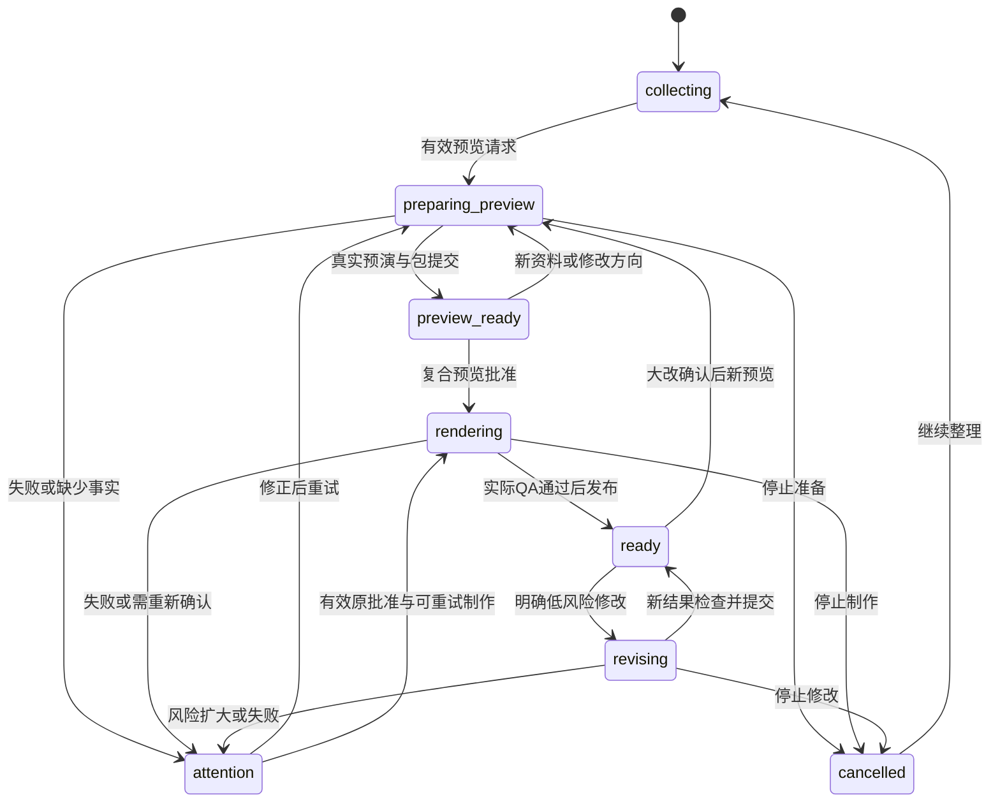

# 02｜领域契约、预览确认与状态机

以下是本应用自定义接口，不是 Mastra / Workflow SDK 的现成类型。`contracts/public.schema.json` 固定外部请求形状；内部类型按本章实现为 Zod + TypeScript，并以严格schema验证。schemaVersion固定5；ID使用服务端UUID，示例UUID只用于合同测试。

## 1. 四种版本，不互相代替

| 名称 | 变化条件 | 用途 |
|---|---|---|
| controlVersion | 项目控制文件每次CAS提交 | 快照新旧排序，不是内容审批依据 |
| briefVersion | 影响影片的事实/偏好/素材选择发生变化 | 防止批准旧内容；闲聊不递增 |
| revisionId | 建立一个新预览/成片候选 | 不可变制作输入与历史追溯 |
| contentVersion | 同一助手消息重新生成/校准 | 防止拼接不同模型尝试的回答 |

**问“到哪了”不使预览过期；纠正活动日期必须使预览过期。** 不得用 `controlVersion !== 客户端版本` 就拒绝所有审批，否则普通聊天和上传进度都会把确认按钮不断作废。客户端提交看到的controlVersion供诊断；服务端用语义基线、previewId/bundleHash、briefVersion做硬校验。

## 2. 主要对象

```ts
interface ObjectRef { key: string; sha256: string; bytes: number; mime: string }
interface SourceRef {
  type: 'user_message' | 'uploaded_material' | 'inferred_preference';
  id: string; locator?: string; excerpt?: string;
}
interface Fact {
  id: string; text: string; sourceRefs: SourceRef[];
  status: 'provided' | 'confirmed' | 'conflicting' | 'excluded';
  mustInclude: boolean; critical: boolean; supersedesFactId?: string;
}
interface Understanding {
  schemaVersion: 5; briefVersion: number;
  subject: string; audience?: string; objective?: string;
  summary: string[]; // 0–3条，仅已知信息
  facts: Fact[]; assetUses: {assetId: string; purpose: string; required: boolean}[];
  preferences: Preferences; skippedTopics: string[];
  askedTopics: string[]; optionalQuestionCount: number;
  unresolvedConflictIds: string[]; sourceMessageIds: string[];
}
interface Preferences {
  durationSec: number; aspect: '16:9' | '9:16'; language: 'zh-CN' | 'en';
  styleSlug: string | null; // null允许Agent选，不能强制用户先选
  voiceMode: 'tts' | 'user_recording' | 'none'; voiceAssetId?: string;
  musicMode: 'composed' | 'user_track' | 'none'; musicAssetId?: string;
  captions: 'auto' | 'none';
}
interface ProjectControl {
  schemaVersion: 5; projectId: string; ownerKeyHash: string;
  controlVersion: number; briefVersion: number; createdAt: string;
  lastUserActivityAt: string; expiresAt: string; deletedAt?: string;
  reviewPolicy: 'preview_first'; understandingRef: ObjectRef;
  phase: ProjectPhase; currentPreviewId?: string; currentResultId?: string;
  inputPending: boolean; previewState: 'none'|'ready'|'stale'|'expired';
  currentApprovalRef?: ObjectRef;
  activeProduction?: OperationPointer; activeConversation?: OperationPointer;
  pendingInputMessageIds: string[]; pendingFeedbackIds: string[];
  assetRefs: ObjectRef[]; revisionIndexRef: ObjectRef; messagesIndexRef: ObjectRef;
  recentCommands: CommandReceipt[]; // 有界热索引；长期command记录另存
  consentEpoch: number; // 取消制作时递增，冻结旧待执行链
}
```

ObjectRef不携带临时签名URL；只在访问时签发。序列化时间用UTC ISO8601；时长用整数毫秒或帧，不混用秒字符串。字符限制以JS code unit计并在前后端一致，用户可见计数不得因emoji把截断内容损坏。

### 2.1 Operation

`kind = chat | asset_analysis | preview | render | change | export | cleanup`。

`status = reserved | queued | running | cancelling | cancelled | succeeded | failed | interrupted | superseded`。

保存id、projectId、commandId、inputHash、revisionId、canonicalRunId、streamEpoch、fence、attemptNo、stage、progress、budgetReservationId、cancellation、input/output refs、error、started/finishedAt。progress只有存在真实分母时才包含completed/total，unit为frames/lines/files/segments。未知阶段不提供百分比。

OperationPointer至少有id/kind/status/canonicalRunId?/streamEpoch/fence；控制文件只放摘要。流epoch默认0；只有旧run已终止且需新run接管时才递增，旧游标reset，旧fence失效。

每项目最多一个生产operation和一个conversation operation。asset_analysis复用当前conversation lane内的步骤：资料传完可排到该lane，不为每个文件暴露一个永久新SSE连接。上传进度为客户端真实网络进度，不混入Workflow事件序列。

### 2.2 Asset / Message / Artifact

Asset保存原始hash、MIME、字节、尺寸/时长/页数、uses、权利声明、上传reservation及分析结果引用。状态为reserved/uploading/uploaded/analyzing/ready/failed/removed。只有ready且用途明确才可作为已理解来源。

Message保存id、clientMessageId?、ordinal、role、status、operationId、contentVersion、parts、sourceRefs、createdAt。ordinal由控制态CAS分配，不按客户端时钟排序。parts是text/attachment/summary/preview_ref/result_ref/activity/change_confirmation/error等类型化数据，不能是可执行HTML。

Artifact保存id、revisionId、type、ObjectRef、durationMs/width/height/fps?、dependencyHashes、validation。type至少支持preview_video/final_video/poster/subtitles/treatment/credits/quality/source_archive/audio_stem/source_manifest。未上传或未验证的文件没有可下载状态。

## 3. 理解结果如何提交

每轮对话基于inputMessageOrdinal和briefVersion生成 `UnderstandingPatch`，允许增加来源事实、明确更正、设置偏好、记录跳过项。Patch只能作用于读取的语义版本；若期间有更正或素材分析完成，重读并合并纯变更，冲突不能最后写入者无声覆盖。

模型必须输出 `effect = no_change | update_brief | pending_followup | clarify_conflict`。程序二次判断：闲聊/进度问答不能改影片；事实改变必须关联用户消息或上传来源。模型说“已整理”不能代替分析状态提交。

待确认预览收到新文件或疑似创作更正：先设置 `inputPending=true`，主按钮暂不可执行，消息给出“新资料已记下，正在确认是否影响效果”。分析无关则解除；相关则递增briefVersion并失效旧预览。上传失败应解除对应pending并呈现失败，不能永久锁住审批。制作中则全部归入下一次修改，运行中的revision保持不可变。

## 4. FilmSpec 与统一 Timeline

```ts
interface FilmSpec {
  schemaVersion: 5; projectId: string; revisionId: string; briefVersion: number;
  style: {slug: string; packVersion: string; upstreamCommit: string};
  output: {width: number; height: number; fps: 24|30|60; totalFrames: number; sampleRate: 48000};
  seed: number; understandingRef: ObjectRef; treatmentRef: ObjectRef;
  factsRef: ObjectRef; timelineRef: ObjectRef; assetManifestRef: ObjectRef;
  sourceManifestRef: ObjectRef; audioManifestRef: ObjectRef;
  runtimeDigest: string; qualityPolicyVersion: string;
}
interface Timeline {
  totalFrames: number; fps: number; sampleRate: 48000;
  sections: TimelineSection[]; shots: Shot[]; cues: CueEvent[];
  narration: NarrationLine[]; music: MusicEvent[]; foley: FoleyEvent[]; captions: Caption[];
  intentionalBlackRanges: {startFrame:number;endFrame:number;reason:string}[];
  intentionalSilenceRanges: {startSample:number;endSample:number;buses:string[]}[];
}
```

上述条目按以下必需字段定义为严格TypeScript/Zod对象，不保留unknown或任意key：
- section：id、startFrame、endFrame、BPM段、小节定义；区间统一半开 `[start,end)`。
- shot：id、start/end、purpose、framing、camera、sourceModule、actorIds、transitionIn/Out、factIds。
- cue：id、sourceShotId、requestedTimeUs、alignmentPolicy、resolvedFrame、resolvedSample、quantizationErrorUs。
- narration：lineId、displayText、spokenText、expectedAsrText、voiceConfigHash、audioRef、sample start/end、wordTimingsRef。
- music/foley：eventId、cueId、instrument/source、pitch?、durationSamples、gainDb、pan。
- caption：id、lineId?、text、start/end、stableReadableStartFrame、styleRef、factIds。

Schema要校验所有引用存在、整数范围、时长一致、镜头全覆盖、转场重叠显式声明、声音不越界。48kHz sample从绝对time计算，不累计四舍五入；重要动作声音可对齐画面帧，音乐保持音频时间精度，记录误差。

## 5. 复合预览包与批准（只有一个正式门）

PreviewBundle是独立不可变manifest：previewId、revisionId、briefVersion、filmSpecRef、scriptHash、factsHash、bundleHash、previewArtifactId、excerptMap、criticalFacts、summary、expiresAt、qualityEvidenceRefs。inputPending与previewState属于ProjectControl中的动态有效性投影，不原地修改不可变PreviewBundle。bundleHash由按键排序的规范JSON计算，包含源码/时间轴/音轨/资产/字体引用/目标profile/runtime/质量策略；**不包含会过期的签名URL、创建时刻或preview文件本身**，避免循环hash。

preview文件hash单独存。预览从该bundle实际渲染，完整文案和关键事实一并展示。用户批准记录：approvalId、projectId、previewId、revisionId、bundleHash、scriptHash、factsHash、briefVersion、clientCommandId、source='preview_button'、ownerKeyHash、approvedAt、consentEpoch。无 `userApprovedStory=true`。

点击后的服务端顺序：访问验证 → command幂等查找 → 读取最新control+preview → 检查未删除/未过期/inputPending=false/语义一致/没有生产中任务/预算 → 原子提交approval指针+render intent+生产槽占用 → 启动工作流。关键校验失败409并返回可理解原因；不能CAS重试时把用户旧hash偷偷换成新hash。

复合预览常规有效期24小时（产品策略）；项目保留30天。过期不立即重算整片：核实依赖、capability与关键事实未变可再生成一个新预览凭据，用户再确认；不能无声继续过期授权。

### 5.1 节选时间映射

预览的合成剪辑不改变原Timeline。每段记 `{previewStartMs,previewEndMs,sourceStartMs,sourceEndMs,shotId}`，长度相等；片间转场如有非原片帧须标非可定位。点击预览第t毫秒，查其区间得到 `sourceStartMs + t - previewStartMs`。FeedbackTarget同时记artifactId、revisionId、sourceTimeMs、previewTimeMs?。找不到映射则只标“这段效果”，绝不传错源时间。

### 5.2 后续修复边界

编码器参数修正等不改创作内容的修复，保留变更diff和输出回归证据；改变文案、事实、主体、构图、语音、明显节奏的修复创建新bundle并回预览确认。变更不能伪装成相同bundleHash。技术QA由程序强制，用户一次确认不意味着系统可跳过QA。

## 6. 状态转换



welcome是未创建项目的UI状态。failed operation不删除currentResultId。rendering中的新资料只更新draft理解和pendingFeedback；该结果仍可完成原批准版本，完成时提示有新意见可处理。用户主动取消另行fence，不以资料变化代替取消。

## 7. 修改与授权

ChangePlan保存targetArtifactId/revisionId、原用户messageId、变更字段、影响集、risk、reason、requiredQualityChecks、budgetReservation、authorization、consentEpoch、baseBriefVersion。不可直接根据关键词只做一个`if(text.includes('音量'))`。

| 分类 | 程序允许的行为 |
|---|---|
| `safe_direct` | 明确目标、无事实改变、预算允许、可逆；例如音乐gain下调3dB（内部默认，回复用日常语言）→新mix→QA→新result |
| `clarify` | 模糊指代、新价格未明确、来源冲突→只问必要问题，无副作用 |
| `preview_required` | 风格/语言/画幅/主题/时长大改，或效果影响扩大→一句说明、先看新效果/先不改 |

`authorization = explicit_message | preview_button | change_button`。safe_direct必须引用确实由用户主动发送的消息；模型建议不是授权。大小/颜色变更可能影响可读性，无法证明只改外观就转preview_required。预算不足时拒绝自动继续，不要求小白理解token。

制作中pendingFeedback默认只记下；仅safe_direct且冻结了用户授权和consentEpoch时，制作成功后才可一次应用合并结果。新结果改变基线或取消发生时，旧计划失效，禁止队列“复活”。“恢复原片”只CAS切换currentResult指针，不重新渲染；同时将待审核大改标过期或重新基于新选定结果生成。

## 8. 兼容旧实现

本次是空仓库新工程，没有旧项目或旧审核状态需要迁移；直接实现preview_first，不增加双审核兼容开关，不先创建awaiting_story/awaiting_look。外部参考代码若包含旧条件，选择性复用时移除其耦合，严禁“按钮隐藏但旧workflow仍在等待”。
