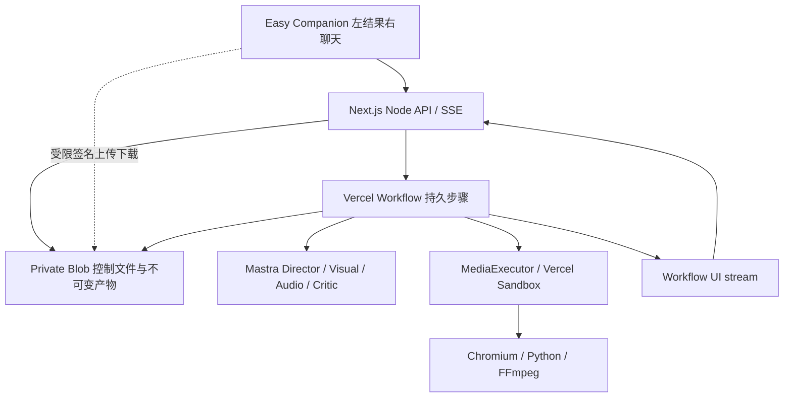

# 03｜Vercel运行架构、无数据库持久化与安全

## 1. 唯一技术路线



Web/API做命令、访问检查、签名与SSE；Workflow做长期耐久执行；Mastra做推理与受控工具；Sandbox做媒体。**不再运行本地常驻Worker，不新增Postgres/Redis/pg-boss，也不同时让Mastra Workflow和Vercel Workflow维护两套相同DAG。** Mastra的执行结果从stage adapter返回结构化产物引用。新建model-adapter，保留参考项目model-provider的多provider/网关配置语义；当前空仓库不预设该文件存在，不强制改成某供应商。[R01][V01][M01]

所有网络、模型调用、Blob读写和Sandbox命令在Workflow的`use step`中；`use workflow`只做可回放的编排、sleep与确定性分支。SDK对象、密钥、二进制媒体不放workflow参数或返回值。`after()/waitUntil`不能代替持久工作流；单个step仍有Function时限。[V01][V02]

独立workflow：`directorTurnWorkflow`、`preparePreviewWorkflow`、`renderApprovedWorkflow`、`applyChangeWorkflow`、`exportWorkflow`、`cancelAndCleanupWorkflow`。创建预览、正式渲染是不同operation；审核期间不占Sandbox，不依赖一条悬挂半天的模型对话。

## 2. 平台能力与必须实测的边界

2026-10-02核对：普通Function流式响应计入最大时长；默认按300秒配置、SSE240秒主动轮换；媒体命令使用detached模式，不在step里等几十分钟。[V02][V06] Workflow stream可从chunk位置续接，但完成后有平台保留期，最终消息与作品必须另归档。[V03][V07]

Private Blob的最新读与ETag条件写是本设计的依赖；最新内容用`useCache:false`，CAS用`ifMatch`，它们不是多对象事务。[V04][V05] 文档和本包类型不代表实际安装的旧SDK已具备这些能力。T00必须在Vercel Preview实测，失败就报告真实阻断，不能退回global Map假称云端已完成。

Sandbox资源文档列CPU、内存和会话时长，不足以证明获得GPU。[V06] 全部风格先跑WebGL2/Three探针，记录实际renderer。允许软件WebGL2通过真实质量与预算验收；不得去掉景深/阴影把3D改成2D。若确需外部GPU，保留MediaExecutor契约、提交部署ADR并获得资源配置后接入；未解决的风格是交付阻断，不能悄悄删出范围。

T00不搭所有基础设施，只验证六件事：Blob一致读/CAS；重复start的claim；SSE续接；detached命令跨Function存活并正确停止；中文字体+声音；一个2D和一个3D少帧探针。该结果决定依赖锁与资源profile，不重新决定已认可UI。

## 3. 文件存储设计

```text
video-v5/<stable-environment>/
  create-intents/<ownerScope>/<clientCreateId>.json
  admission/control.json
  projects/<projectId>/control.json
  projects/<projectId>/commands/<commandId>.json
  projects/<projectId>/indexes/messages/<hash>.json
  projects/<projectId>/indexes/revisions/<hash>.json
  projects/<projectId>/messages/<messageId>/<contentVersion>/<hash>.json
  projects/<projectId>/understanding/<briefVersion>/<hash>.json
  projects/<projectId>/assets/<assetId>/original/<hash>.<ext>
  projects/<projectId>/assets/<assetId>/analysis/<hash>.json
  projects/<projectId>/revisions/<revisionId>/...immutable manifests...
  projects/<projectId>/operations/<operationId>/control.json
  projects/<projectId>/operations/<operationId>/attempts/<attemptId>/...refs...
  projects/<projectId>/artifacts/<artifactId>/<hash>.<ext>
```

环境命名在同一Preview分支持续部署间稳定；Production使用独立store优先，其次独立namespace/签名key/预算。key由服务器构造，客户端只传ID，永远不接受任意Blob URL/路径作为资源权限依据。

### 3.1 数据持有者

| 内容 | 权威来源 | 更新频率 |
|---|---|---|
| 当前状态、预览/成片指针、两个活跃lane、审批/取消 | project control.json | 有意义状态改变，CAS |
| 单operation实际进度、stage attempt、sandbox引用 | operation control.json | 阶段边界或≤1次/15秒检查点；终态必须提交 |
| 最终/中断/停止消息 | immutable message + index | 完成或持久检查点；不每token写 |
| 流式文字/工具进度 | Workflow UI stream | 聚合100ms或256字符的增量，单chunk≤16KiB |
| 媒体与制作manifest | immutable Blob | 先验证再将引用发布 |
| 最近项目、未发送草稿 | 浏览器本地 | 非权威，不存服务密钥/匿名凭证 |

每项目control目标≤64KiB、硬上限256KiB；索引分块，每块≤100条引用；每项目最多1000条消息和100个线性revision。命令热索引最近128条；完整命令保留到项目删除，分页引用由服务端控制。上限到达给出保存/新建提示，不静默删除。这里只为单项目服务，不支持跨项目事务或全站用户搜索。

### 3.2 CAS算法

`readFresh<T>(key): Promise<{value:T;etag:string}>`必须从同一次读取得到正文与ETag，不能独立GET正文再HEAD版本。控制文件首次初始化用create-if-absent（不覆盖已有key），竞争失败者读胜者内容；T00同时验证原子初建语义。`cas(key,etag,next)`做条件覆盖；对冲突重读后重新计算纯变更，最多5次指数抖动重试。不能自动放宽原始preview/brief/owner等语义前置条件。

跨多个对象没有原子性：先写不可变消息/产物/index；最后一次project CAS更新可见指针。project CAS是用户可见状态的提交点。operation control中的ready不能替代project pointer发布。中途崩溃留下孤立文件，清理可重试；UI只展示project已提交引用。

短期流显示的是草稿增量。最终message.completed必须在归档/指针提交之后发；若事件丢失，后续快照校准。不要“先显示下载成功，再尝试上传文件”。

## 4. 命令、启动和claim

每个写意图有clientCommandId(UUID)+规范bodyHash。相同ID/相同body返回相同receipt；同ID不同body返回409 IDEMPOTENCY_CONFLICT。请求重试期间不要重新生成UUID。项目创建以ownerScope+clientCreateId记录一个不可变创建intent，再创建其projectId；并发创建失败者读回胜者intent。

普通命令：校验 → immutable intent → project CAS预留operation/lane/消息ordinal → `start()` → 返回202 receipt。**官方start每次都会创建run，业务防重由claim完成，不是平台自动exactly-once。**[V08]

每个run第一步 `claimOperation(projectId,operationId,runId)`：CAS绑定唯一canonicalRunId；相同run重试允许继续；其他run返回已有绑定并退出，不调模型、不占Sandbox。客户端和SSE只认识operationId，不能从请求注入任意workflowRunId。

预留后start失败：操作保留reserved并返回503含同receipt；原命令重试、显式recover或运维sweeper重新启动，claim仍保证单一业务执行者。start已接受但响应丢失：查commands/{id}，不重复一条用户消息。不做“202已接受但在请求返回后用无人等待的Promise才启动”。

### 4.1 不要漏掉step级防重

canonicalRun只能防竞争run，不能防同一step在“外部操作已成功、step结果未保存”时重试。每个模型/工具/媒体阶段有稳定stageKey与effect record。读取已有完成结果就复用；未知结果先查询，不默认重复扣费。

媒体使用deterministic sandboxName和stage attempt路径。trusted runner原子创建stage lock，记录pid+startTime+stageKey；重复runCommand只返回现有状态，不重复渲染。runner完成写marker，再释放lock。PID不可靠时使用启动时间与实际命令状态；这只是单Sandbox内防重，不充当云端锁。

模型供应商若无幂等请求支持，网络超时边界可能已经计费但结果未知。用量记录unknown，不声称恰好一次；自动重试预算必须预留可能重复费用。

### 4.2 取消与发布竞争

先project CAS写cancelRequested、递增consentEpoch/fence并清掉关联未启动反馈，再启动独立cancelAndCleanupWorkflow停止Sandbox/模型轮次。发布前再读fence与owner，迟到产物可存档但不成为currentResult。

取消先赢：旧发布被拒绝。发布先赢：取消接口返回already_completed，保留真实成片，不把完成操作倒改成cancelled。cancelled只有在进程已停/命令终态可验证或会话超时已确认之后提交；否则持续cancelling并报警。停止chat不动activeProduction。

## 5. 无登录访问、反滥用和预算

自动签发HttpOnly、Secure、SameSite=Lax、Path=/、30天的256bit随机sid，服务端HMAC签名含keyId/到期/环境。项目ownerKeyHash从sid派生；不存用户表，不展示账号。所有读取、消息、SSE、资料签名、取消、导出都校验；project UUID不是秘密。不存在与无权限统一404以避免枚举。

LocalStorage只存最近projectId、公开标题和草稿；清除cookie后无法保证找回。恢复/分享密钥和跨设备账号不在本版。刷新cookie有效期保持sid稳定；签名密钥轮换支持短期旧key验证，不使进行中的项目无声丢失。匿名凭证只是访问控制，不是身份真实性证明。

Origin/Host/CSRF检查写接口；禁止任意CORS；返回JSON/SSE `private,no-store`。日志不打印cookie、prompt全文、上传文件内容、signed URL。系统默认关闭通用匿名任意文件访问接口。开发localhost可在明确development环境用非Secure cookie；Production/Preview必须Secure且按真实Origin配置，禁止生产沿用localhost例外。

公网计费入口必须有bot防护/速率门槛以及部署总量预算。无账号且清cookie可重建身份，不能只凭sid限流；使用Vercel防护规则和匿名scope预算组合。不接Redis，不添加登录来回避此要求。最低默认：每匿名scope一条重制作、全部署两条、预览和制作共享重槽；chat单project一条。超容量429+Retry-After，UI说明稍后重试，不无限排队。

采用小型`admission/control.json` CAS原子预留deployment+owner额度；预留含operationId/reservationId/真实资源ID，过期不得直接当旧任务已停。独立协调器确认终态后释放；释放核对reservationId，防止旧finally释放新租约。启动/取消失败路径均有补偿。此admission只管容量，不编排影片DAG。

预算配置须具备：每项目/每日LLM输入输出token上限、调用次数、TTS字符、Sandbox总秒/内存profile、自动修复轮次、全站暂停开关。模型价格未知时只报资源用量不杜撰金额；运营在启用真实生成前配置并实测cost profile。每阶段最多2轮创作修复；基础网络最多2次重试；超过即attention。执行阈值是产品保护，不宣称某影片必然在预算内完成。

## 6. 媒体安全边界

不可信场景代码只在独立Sandbox/browser中执行，不在Next进程、不在主站iframe。固定依赖/字体/样片技法预先准备；运行时禁git pull/npm install/任意shell。生成代码静态检查是第一道防线，不是安全隔离的替代。

使用networkPolicy deny-all或精确允许名单；默认不继承Function环境；不把Blob RW、模型key、Vercel token传到不可信VM。[V09] 可信下载/上传/QA与不可信执行分开阶段或分开隔离环境，不能在仍有不可信后台进程的沙箱里临时开放网络或注入上传凭证。

推荐媒体执行过程：可信准备输入 → 关闭外网/无凭证场景渲染 → 终止所有不可信进程 → 控制器读取白名单输出 → 独立可信工具验证/打包 → 上传。大文件通过受限路径、时效、长度的上传能力，由可信transfer sandbox完成；不是把全store凭据暴露给页面。若采用SDK readFile流转移，T00必须验证大小/超时，不在普通JSON响应中传视频。

输出可信度独立验证：不接受生成代码自己写的“QA通过”，不接受模型任意文件路径。验MIME/hash/实际解码，拒绝绝对路径、..、symlink/hardlink、压缩炸弹、超量文件、控制字符。HTTP静态服务根仅当前job+审核依赖，不开放项目控制文件和资产外的文件系统。

## 7. 留存、清理与可恢复承诺

项目默认最后用户活动后30天；后台心跳不能延寿。运行中的依赖不清理，设置最长制作预算并取消超时任务，不能让“running”永久占空间。新请求先检查expiresAt，返回410。删除先tombstone禁止访问、取消资源，再删文件；已发signed URL可能在短期内仍可用，不承诺瞬时撤销。

sweeper按项目目录分页只查control，处理过期、reserved未启动、孤立产物、过时预约、流结束但终态未提交。间隔由部署计划支持能力配置，不能把Cron调用结果假定成准时可靠；用户recover也能触发同一幂等协调逻辑。

承诺层级：页面断线不断制作；Function更替由Workflow恢复；Sandbox损坏重跑未提交阶段；已验收文件保留。**不承诺恢复任意FFmpeg指令，也不承诺第三方请求费用恰好一次。**
