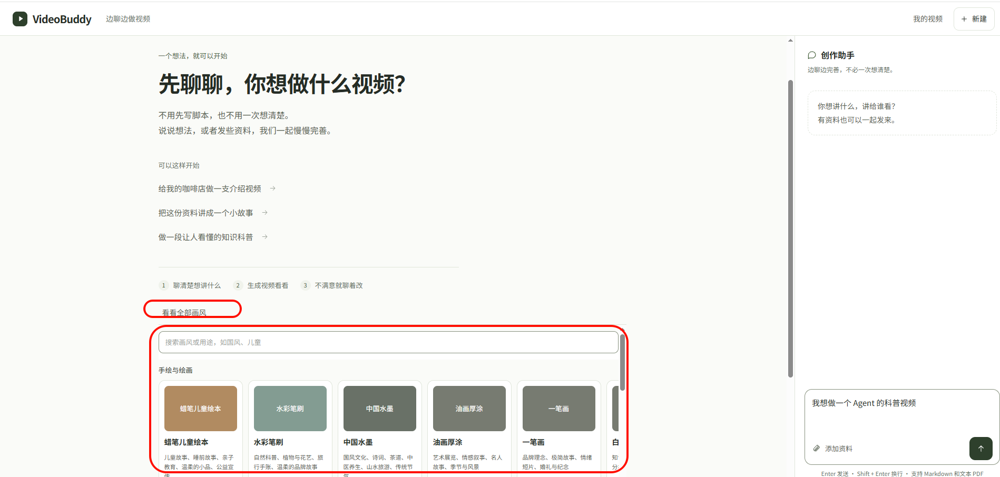
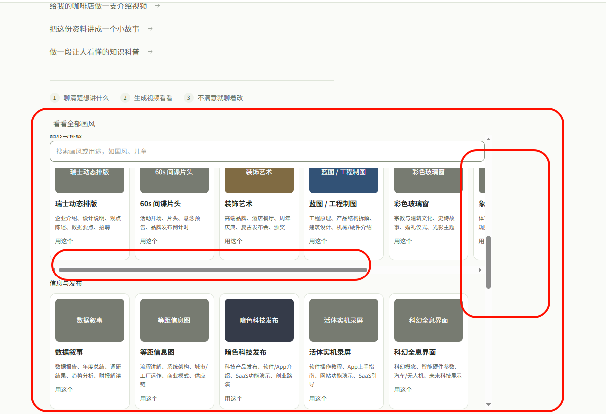
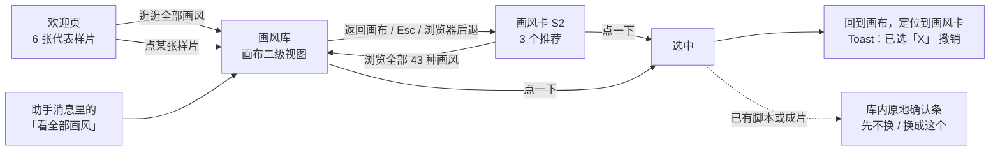
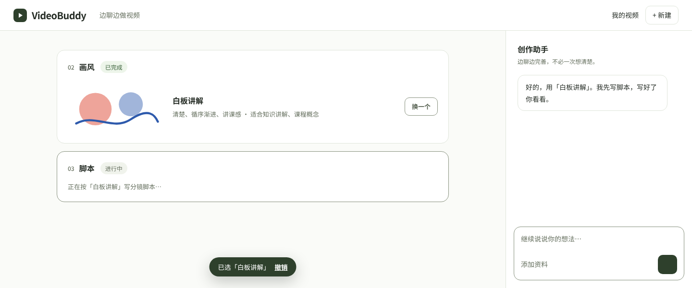
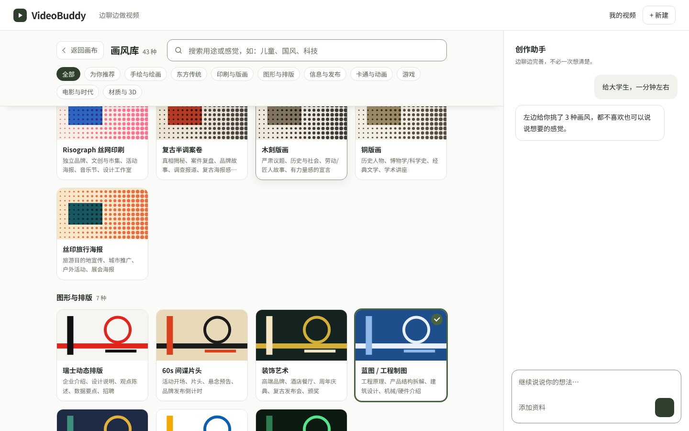
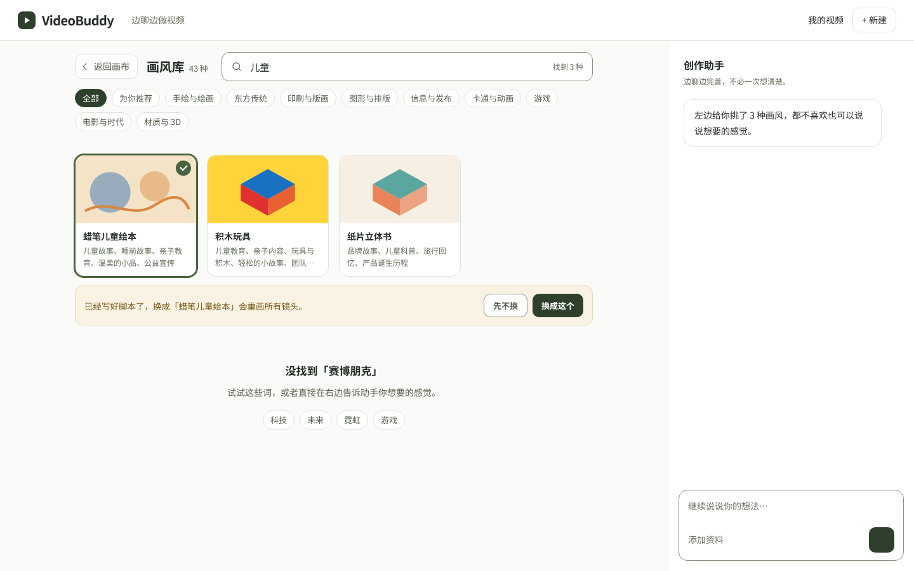
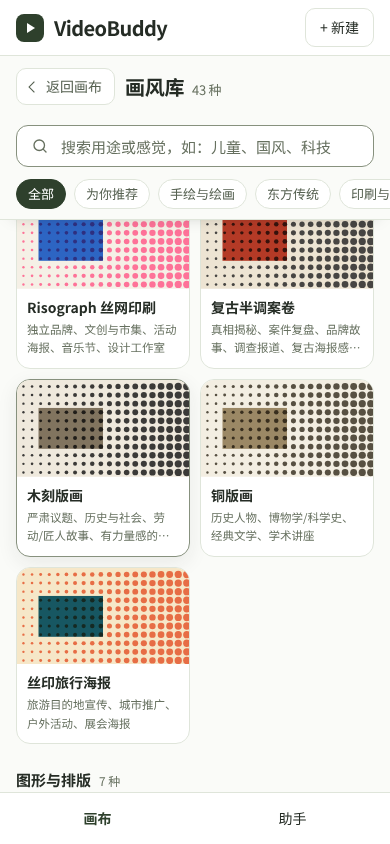

# 画风选择 UI 交互调整方案

- 版本：v1.0（2026-10-10）
- 基线代码：`main` @ `ade4f7f`（PR #4 本地 runtime 合并后）
- 关联文档：`docs/product/canvas-assistant-ux.md`（画布 + 助手总体交互）
- 读者：前端、设计
- 性质：交互与视觉调整方案，本文不改代码
- 涉及文件：
  - `src/components/video-studio/style-picker.tsx`
  - `src/components/video-studio/canvas/StyleBrowser.tsx`
  - `src/components/video-studio/canvas/StyleCard.tsx`
  - `src/components/video-studio/welcome-canvas.tsx`
  - `src/components/video-studio/canvas/Canvas.tsx`
  - `src/app/globals.css`（约 369–444 行）

---

## 0. 结论

现在的画风选择有三个层面的问题：**滚动嵌套**、**吸顶穿透**、**信息架构不对**。前两个是 CSS 缺陷，第三个是设计问题。只修 CSS，体验仍然不好。

调整后的方案只有五条：

1. **推荐优先，浏览兜底**：用户在画风卡里看到的是为他挑好的 **3 种**；完整的 43 种是"都不太对"时才去的地方。
2. **画风库是画布的二级视图，不是弹窗，也不是卡片里的折叠面板**：它接管左侧画布的内容，右侧助手照常可用。
3. **一个窗格只有一个滚动条**：画布内禁止再出现纵向滚动容器，也禁止横向滚动行。
4. **看图选**：样片是主角，名字和用途是辅助。缩略图不再重复印一遍画风名。
5. **点一下就选，能撤销**：只有会产生成本（要重画已有镜头）时，才在原地确认一次。

---

## 1. 问题诊断

### 1.1 现状截图

| 欢迎页展开"看看全部画风" | 滚动中 |
|---|---|
|  |  |

### 1.2 问题清单与根因

| # | 问题 | 用户感受 | 根因（代码位置） |
|---|---|---|---|
| Q1 | **滚动条套滚动条**：画布本身一条纵向滚动，画风浏览器内部又一条纵向滚动，每个分类行还有一条横向滚动 | 滚轮不知道在滚哪一层；鼠标停在卡片行上只能横滚，"卡住了" | `.work{overflow:auto}` 里套了 `.style-browser{max-height:60vh;overflow:auto}`，再套 `.style-browser-row{overflow-x:auto}`，一共三层滚动 |
| Q2 | **搜索框穿透**：往下滚时，上一个分类的标题和卡片从搜索框上方的缝隙里露出来 | 看起来像出了 bug，显得粗糙 | `.style-browser` 有 `padding:12px 0`。吸顶元素 `top:0` 停在滚动容器的内容区顶部，上面那 12px 的 padding 区域仍然会显示滚过的内容。另外搜索条背景是白色 `--vb-surface`，页面背景是 `--vb-canvas`，两者色差形成一条"白带" |
| Q3 | **卡片被截断**：每行最右边一张卡只露出一半（如"白…"、"象…"） | 不知道后面还有多少，也不知道要横着滚 | 固定宽度 `160px` 的卡片放进横向滚动行，行宽不是卡宽的整数倍 |
| Q4 | **缩略图没有信息量**：灰绿色块上印着画风名，下面又写一遍名字；大部分颜色接近（没配色的统一是 `#777b71`） | 43 种看起来差不多，凭名字猜不出样子；"小白"本来就不懂"Risograph"是什么 | `public/style-samples/` 里没有样片，只有 README；`StyleSample` 的兜底就是"纯色块 + 名字" |
| Q5 | **每张卡都有"用这个"**，和卡片本身的点击重复 | 视觉噪音；不清楚点卡片和点"用这个"有什么区别 | `StyleBrowser` 的每个按钮里都带 `用这个` |
| Q6 | **欢迎页直接内联展开 43 种** | 还没说要做什么，就被一大堆选项淹没；和"先聊清楚再推荐画风"的产品原则相反 | `Canvas.tsx` 的 S0 分支把 `StylePicker` 作为 `WelcomeCanvas` 的 `extra` 渲染 |
| Q7 | **入口位置和层级不对**："看看全部画风"挂在"三步说明"下面，像页脚链接；展开后把页面撑到很长 | 不像一个功能入口；展开以后找不到收起的地方 | `.secondary-row` 里只有一个 `text-button` |
| Q8 | **选中后没有反馈**：点了以后直接往聊天里发一句"画风用「X」"，浏览器收起 | 不确定选上了没有；选错了不知道怎么改回去 | `StylePicker` 里 `onSelect` 后直接 `setOpen(false)` |
| Q9 | **画风卡里又塞了一个同样的浏览器**："看更多画风"在卡片内部展开同一个滚动浏览器 | 卡片里嵌滚动，Q1、Q2 在画布中段再出现一次 | `StyleCard.tsx` 的 `more && <StyleBrowser/>` |
| Q10 | **移动端推荐卡被压扁**：3 张卡硬挤成 3 列，徽标字号缩到 9px | 看不清，点不准 | `@media(max-width:959px)` 里的 `.style-recommendations{gap:6px}`、`.style-choice .badge{font-size:9px}` |

---

## 2. 第一性原理：小白选画风这件事的本质

| 事实 | 推论 |
|---|---|
| 用户不懂画风术语，判断依据是"看起来对不对" | **样片是主角**，名字只是标签；"适合做什么"比风格术语更有用 |
| 43 种是长尾，大多数人只需要在少数几个里挑 | **先给 3 个推荐**（助手根据需求挑，附一句理由），完整列表是兜底 |
| 选画风可逆，在写脚本之前改，几乎没有成本 | **点一下就生效**，用"撤销"兜底，不弹确认 |
| 脚本或成片出来以后再换画风，所有镜头都要重画 | **只有这时才确认**，并且在原地确认，不弹窗 |
| 左边画布、右边助手是产品的基本结构，用户随时可能问助手 | 浏览画风时**助手必须一直可见、可用**，所以画风库不能做成遮罩弹窗 |
| 嵌套滚动在触控板和鼠标滚轮上都很难控制 | **每个窗格只保留一个滚动** |

---

## 3. 新的结构与流程

**入口**：只有三个，都打开同一个画风库视图。

- 欢迎页的"逛逛全部画风"。
- 画风卡底部的"浏览全部 43 种画风"。
- 助手消息里的"看全部画风"操作。

**出口**：

- 选中一个画风。
- 点"返回画布"、按 Esc，或者用浏览器后退（移动端是返回手势）。

---

## 4. 页面与组件规格

> 示意图里的缩略图是**占位插画**，演示的是"样片缺失时的兜底样式"。正式样片见 §4.6。可交互原型：`docs/product/assets/style-picker/prototype.html`，用 `?v=welcome|card|library|search|selected` 切换页面，加 `&m=1` 查看移动端。

### 4.1 欢迎页（S0）

- **删除**欢迎页里的内联画风浏览器（`StylePicker`）。
- 示例按钮下方新增一个小节"能做出这样的视频"，放 **6 张代表样片**：
  - 6 个不同大类各取一张，3 列 × 2 行的网格。**固定 6 张，不滚动，不展开。**
  - 建议取：蜡笔儿童绘本、纸雕灯影、数据叙事、Risograph、16-bit 像素 RPG、积木玩具。
- 小节副标题说明规则："聊完想法后，助手会从 43 种画风里挑 3 种给你。"
- 小节右上角是"逛逛全部画风"，打开画风库。
- **点某张样片**：打开画风库，并滚动定位、高亮这张样片。**不直接选中**，避免用户还没说需求就误触发了一条聊天消息。
- 卡片用紧凑版（`compact`）：用途只显示 1 行。

### 4.2 画风卡（S2，"需要你选"）

- 提示语："根据「{主题}」挑了 3 种，点一下就能选。"
- **3 张推荐卡**：
  - 画布内容宽度 ≥ 640px 时 3 列；小于 640px 时改为**单列横排**（缩略图在左，160 × 90），不再挤成 3 列。
  - 第一张带"推荐"徽标。
  - 卡片正文显示**助手给的理由**（`StyleRecommendation.reason`，≤ 30 字，最多 2 行），而不是通用的"适合"文案。理由才是推荐的价值所在。
  - **整张卡就是按钮**，删掉卡内的"用这个"按钮。桌面端悬停时，右上角出现"选这个"小标签作为提示。
- 卡片底部：左边写"都不太对？"，右边是"浏览全部 43 种画风"，打开画风库。
- **删除**卡片内部的折叠浏览器（`more && <StyleBrowser/>`）。

**已选状态**：

- 卡片收起为一行：缩略图（200px 宽）+ 画风名 + "气质 · 适合…" + 右侧"换一个"按钮。
- "换一个"会回到 3 张推荐的状态，而不是直接跳进画风库。当前画风如果不在推荐里，就放在第一位，并标出"当前"。

### 4.3 画风库（画布二级视图）

**形态**

- 画风库**替换画布 `.work` 里的内容**，复用画布这一个滚动容器。右侧助手不变，也不加遮罩。
- 打开时用 `history.pushState({view:'styles'})` 记录一步，这样浏览器后退和移动端返回手势都能关闭画风库。
- 关闭后，画布滚动位置**恢复到打开前的位置**，焦点回到触发它的按钮上。

**吸顶头部**（`position:sticky; top:0`）

- 第一行：返回画布、标题"画风库 43 种"、搜索框（占满剩余宽度）。
- 第二行：分类筛选，依次为"全部 / 为你推荐 / 手绘与绘画 / 东方传统 / 印刷与版画 / 图形与排版 / 信息与发布 / 卡通与动画 / 游戏 / 电影与时代 / 材质与 3D"。桌面端自动换行。
- 背景用**不透明的 `--vb-canvas`**，和画布同色，不再出现"白带"。
- 页面滚动后，头部加一条底线和轻阴影（`.scrolled`），表示下面还有内容在滚动。

**内容**

- 网格：`grid-template-columns: repeat(auto-fill, minmax(184px, 1fr)); gap: 16px`。**自然换行，没有横向滚动，没有截断。**
- 选"全部"时按分类分组，组标题显示"分类名 + N 种"；选单个分类或在搜索时，平铺显示结果。
- "为你推荐"显示助手给的 3 个推荐，以及 `recommendStyles` 本地匹配的前 6 个。

**卡片状态**

| 状态 | 样式 |
|---|---|
| 默认 | 白底、1px `--vb-line` 边框、14px 圆角 |
| 悬停（桌面） | 边框改为 `--vb-control-line`，加轻阴影，右上角出现"选这个"标签；有循环样片时开始播放 |
| 键盘焦点 | 全局 `:focus-visible` 描边 |
| 已选（当前项目的画风） | 2px `--vb-accent` 描边，右上角对勾，`aria-pressed=true` |
| 推荐 | 名字后面加"推荐"徽标 |
| 不可用（生成中） | 不响应点击，鼠标指针显示禁用，悬停提示"正在生成，稍后再换" |

**搜索与空结果**

- 搜索**即时过滤**（150ms 防抖），匹配范围：中文名、英文名、id、适合（goodFor）、气质（mood）、关键词（keywords）。
- 搜索框右侧显示"找到 N 种"，同时用 `aria-live=polite` 播报给读屏用户。
- 没有结果时，标题写"没找到「{词}」"，下面给 4 个可点击的建议词，再加一句"或者直接在右边告诉助手你想要的感觉"。空结果是把用户引回助手的时机。

### 4.4 选中后的反馈

| 场景 | 行为 |
|---|---|
| 还没有脚本或成片 | 点一下就选中。关闭画风库，回到画布并滚动到画风卡（卡片已是"已选"状态）。底部弹出 Toast："已选「X」 撤销"，停留 5 秒；点撤销恢复原来的画风。助手照常回复一句确认 |
| 已有脚本或成片 | 画风库**不关闭**，在结果网格下方**原地**出现确认条："已经写好脚本了，换成「X」会重画所有镜头。"，按钮为"先不换"和"换成这个"。确认后再执行上一行的流程 |
| 提交失败 | 恢复原来的画风；画风卡上显示现有的错误提示"没改成功，原来的选择已保留，再试一次。" |

Toast 不是弹窗：不打断操作、不抢焦点，可以忽略。

### 4.5 移动端（< 960px）

- 画风库占满"画布"标签页，底部的"画布 / 助手"标签保持可见。
- 网格固定 2 列，间距 10px。
- 搜索框单独占一行。
- 分类筛选改为**单行左右滑动**。这是全文唯一允许的横向滚动：它只是一排小标签，不是内容；隐藏滚动条，右边缘做渐隐，提示还能滑。
- 没有悬停态，不显示"选这个"标签，点一下就是选中。
- 选中后自动切回"画布"标签，定位到画风卡。
- 推荐卡（§4.2）在移动端一律用单列横排。

### 4.6 样片

样片是这次调整里**最重要的一项资产**。没有真样片，就无法做到"看图选"。

| 项 | 规格 |
|---|---|
| 封面图 | `public/style-samples/{id}.jpg`，640 × 360，≤ 60 KB，渐进式 JPEG |
| 循环样片（可选） | `public/style-samples/{id}.mp4`，3 s，640 × 360，H.264，无声，≤ 400 KB |
| 内容 | **43 种画风画同一个主题**，建议"一杯咖啡和一行标题"。用户比较的应该是风格，而不是内容 |
| 生成方式 | 新增 `scripts/video/build-style-samples.ts`：用本地 runtime 为每种画风渲染一个固定的演示场景，场景 HTML 存放在 `public/style-samples/src/{id}.html`，可以复现。生成结果入库 |
| 缺失时的兜底 | 用画风自带的双色配色加一个品类图形（示意图就是这种），**不在缩略图里印画风名**。需要在 `styleFits` 中给每个画风加 `swatch: [背景, 前景, 强调]` |
| 播放规则 | 只在桌面端悬停时播放，同一时间只播一个；`prefers-reduced-motion` 时不播放；离开视口就暂停 |
| 加载 | 封面 `loading="lazy"`。画风库打开时，首屏请求的图片 ≤ 12 张 |

---

## 5. 视觉规格

沿用现有设计令牌（`src/styles/video-easy-tokens.css`），**不新增颜色**。

| 元素 | 规格 |
|---|---|
| 卡片 | 圆角 14px；边框 1px `--vb-line`；背景 `--vb-surface`；缩略图 16:9 顶部通栏，不留内边距 |
| 卡片正文 | 内边距 10px 12px 12px；名字 14px / 650；用途 12px / 1.6，最多 2 行，超出省略，`min-height` 保证同一行的卡片等高 |
| 推荐理由 | 12.5px / 1.65，颜色 `--vb-secondary` |
| 徽标 | "推荐"使用 `--vb-success-bg` / `--vb-success`，11px |
| 已选 | `box-shadow: 0 0 0 2px var(--vb-accent)`；对勾是 24px 圆形 `--vb-accent` |
| 吸顶头部 | 背景 `--vb-canvas`；滚动后加 `border-bottom: 1px solid var(--vb-line)` 和 `box-shadow: 0 8px 16px -14px rgba(37,44,37,.35)` |
| 搜索框 | 高 46px（移动端 42px）；边框 1px `--vb-control-line`；圆角 12px；内置放大镜图标 |
| 分类筛选 | 13px；圆角 999px；选中态为 `--vb-action` 底、白字 |
| 网格 | `minmax(184px,1fr)`，间距 16px；移动端 2 列，间距 10px |
| 动效 | 只用于响应操作：悬停 140ms 边框和阴影变化；返回画布时平滑滚动到画风卡；尊重 reduced-motion |

---

## 6. 滚动与层级规则（全局约束）

这一节是 Q1 和 Q2 的根治办法，也作为画布今后所有内容的约束：

1. **画布 `.work` 是左侧唯一的纵向滚动容器。** 它的子孙元素不允许设置 `overflow:auto|scroll` 加 `max-height`。例外只有一个：移动端的分类筛选行（横向）。
2. **画布内不允许横向滚动的内容行。** 卡片一律用自动换行的网格。
3. **吸顶元素**：
   - 吸顶元素的滚动容器**不能有上内边距**。需要留白时，把内边距放到吸顶元素自己身上。
   - 吸顶元素必须有**不透明背景**，且与容器同色。
   - `z-index` 至少为 5，高于卡片内部的定位元素（缩略图、对勾、视频）。
   - 滚动容器设置 `scroll-padding-top: <头部高度>`，避免锚点定位时目标被头部挡住。
4. `.work` 加 `overscroll-behavior: contain`，滚到底时不带动整页回弹。
5. 在 lint 或测试中加一条检查：组件内出现 `overflow` 加 `max-height` 的组合需要审查，可以写成 stylelint 自定义规则或 Playwright 断言（见 §9）。

**需要删除或修改的现有 CSS**（`src/app/globals.css`）：

- 删除：
  - `.style-browser{max-height:60vh;overflow:auto;…}`
  - `.style-browser-search{position:sticky;…}`
  - `.style-browser-row{display:flex;overflow-x:auto;…}`
  - `.style-browser-row .style-choice{width:160px;flex:none}`
- 删除：`.style-choice` 系列的 `!important` 覆盖（约 370–373、441–444 行），改为新的 `.style-tile` 样式。
- 修改：`.style-recommendations` 改为 §4.2 的响应式规则，删除移动端 9px、10px 字号的压缩写法。
- 修改：`.style-sample-surface>span`，缩略图里不再显示文字。

---

## 7. 文案

| 位置 | 文案 |
|---|---|
| 欢迎页小节标题 | 能做出这样的视频 |
| 欢迎页小节说明 | 聊完想法后，助手会从 43 种画风里挑 3 种给你。 |
| 欢迎页入口 | 逛逛全部画风 |
| 画风卡提示 | 根据「{主题}」挑了 3 种，点一下就能选。 |
| 画风卡底部 | 都不太对？ · 浏览全部 43 种画风 |
| 悬停提示 | 选这个 |
| 画风库标题 | 画风库 · 43 种 |
| 搜索占位 | 搜索用途或感觉，如：儿童、国风、科技 |
| 搜索计数 | 找到 {n} 种 |
| 空结果 | 没找到「{词}」 / 试试这些词，或者直接在右边告诉助手你想要的感觉。 |
| 返回 | 返回画布 |
| Toast | 已选「{名}」 · 撤销 |
| 原地确认 | 已经写好脚本了，换成「{名}」会重画所有镜头。 · 先不换 / 换成这个 |
| 生成中禁用 | 正在生成，稍后再换 |
| 已选卡片 | 换一个 |

---

## 8. 组件与代码改动清单

### 新增

- `canvas/StyleTile.tsx`：统一的画风卡片，用于欢迎页、推荐和画风库。
  - 参数：`style, variant: 'compact'|'default'|'row', reason?, recommended?, selected?, disabled?, onSelect`。
  - 渲染为 `<button aria-pressed>`，内部包含 `StyleSample`。
- `canvas/StyleLibrary.tsx`：画风库视图，包括吸顶头部、搜索、分类筛选、分组网格、空结果和原地确认条。
  - 参数：`current, recommendations, needsConfirm, focusId?, onSelect, onClose`。
- `canvas/StyleInspiration.tsx`：欢迎页的 6 张样片小节。
- `scripts/video/build-style-samples.ts` 和 `public/style-samples/src/*.html`：样片生成（§4.6）。

### 修改

- `canvas/Canvas.tsx`：
  - 新增视图状态 `canvasView: 'flow' | 'styles'` 和 `libraryFocusId`。
  - 为 `styles` 时渲染 `<StyleLibrary/>`，否则渲染现有卡片流。
  - 打开时 `pushState`，监听 `popstate` 关闭。
  - 关闭时恢复 `scrollTop`，并 `go('style')`。
  - S0 分支不再给 `WelcomeCanvas` 传 `StylePicker`，改为传 `StyleInspiration`。
- `canvas/StyleCard.tsx`：
  - 推荐区改用 `StyleTile`，显示 `reason`。
  - 删除 `more` 折叠和内嵌的 `StyleBrowser`；底部"浏览全部"调用 `openLibrary()`。
  - 已选状态按 §4.2 实现。
- `style-picker.tsx`：
  - 删除 `StylePicker` 组件。
  - `StyleSample` 去掉缩略图里的文字，改用 `swatch` 兜底；悬停播放逻辑按 §4.6 实现。
- `canvas/StyleBrowser.tsx`：删除，由 `StyleLibrary` 取代。
- `services/video/styles/recommendations.ts`：`StyleFit` 增加 `swatch`；`StyleBrowser` 里的搜索匹配逻辑移到这里，导出 `searchStyleFits(query)`，供画风库和测试共用。
- `contracts/video/guidance-ui.ts`：`CanvasTargetSchema` 增加 `'style-library'`，让助手消息里的"看全部画风"可以通过现有的 `canvasRefs` 打开画风库，不新增协议。
- `app/globals.css`：按 §6 删除和修改；新增 `.style-tile`、`.style-library*` 样式。
- `components/video-studio/style-catalog.tsx`（独立页面 `/video/styles`）：复用 `StyleTile` 和网格样式，保持视觉一致。

### 埋点（`trackCanvasEvent`）

| 事件 | 参数 |
|---|---|
| `style_library_open` | `from: 'welcome'\|'card'\|'chat'\|'inspiration'` |
| `style_search` | `length`（只记录长度，不记录内容）、`results` |
| `style_filter` | `category` |
| `style_selected` | 保留现有字段 `id, fromRecommend, origin`，新增 `rank`（推荐里的位置）和 `surface: 'card'\|'library'` |
| `style_undo` | `id` |
| `style_change_confirm` | `result: 'confirm'\|'cancel'` |

核心指标：**推荐命中率** = 从推荐直接选中的次数 ÷ 选画风的总次数；目标 ≥ 60%。

---

## 9. 验收标准

**滚动与层级**（Playwright 自动化，在 1440×900、1280×720、1024×768、390×844 四个尺寸下跑）

1. 画风库打开时，左侧画布中 `scrollHeight > clientHeight` 且 `overflow-y` 为 `auto/scroll` 的元素**只有 `.work` 一个**。
2. 画布中**没有横向滚动**：`.work.scrollWidth <= .work.clientWidth`，所有卡片完整可见。移动端的分类筛选行除外。
3. 吸顶不穿透：把画风库滚到 25%、50%、75%、100% 位置，在吸顶头部区域内每隔 40px 横向取点做 `elementFromPoint`，命中的元素都应该属于头部。
4. 用锚点定位到某个分类或画风时，目标不会被吸顶头部遮住。

**交互**

5. 在画风卡（S2）里，**点 1 次**就能选中推荐画风；43 种中的任意一种，**最多 3 步**能选中（打开画风库 → 搜索或筛选 → 点击）。
6. 返回画布、Esc、浏览器后退三种方式都能关闭画风库；关闭后滚动位置恢复，焦点回到触发按钮。
7. 选中后自动回到画布并定位到画风卡；Toast 显示 5 秒；点撤销后恢复原画风，助手侧也能看到状态变化。
8. 已有脚本时选新画风，出现原地确认条；"先不换"不产生任何请求。
9. 生成进行中，画风卡片不可点击，并有说明文案。
10. 欢迎页不再出现内联浏览器；点样片会打开画风库并定位到该画风，但**不发送任何聊天消息**。

**可访问性与性能**

11. 只用键盘能完成：打开画风库 → 搜索 → 用 Tab 和 Enter 选中 → 回到画布；焦点描边始终可见。
12. 读屏会播报"找到 N 种"；卡片会读出名字、用途，以及"已选"或"推荐"。
13. 开启 reduced-motion 时不自动播放任何样片。
14. 打开画风库时首屏图片请求 ≤ 12 张；Chromium 下从点击到画面稳定 ≤ 300ms（不含图片加载）。

---

## 10. 实施顺序与估时

| 步骤 | 内容 | 估时 | 说明 |
|---|---|---|---|
| 1 热修 | 删掉嵌套滚动（`.style-browser` 的 max-height/overflow 和横向行），网格自动换行；修正吸顶（去掉容器上内边距，背景改为 `--vb-canvas`）；删除卡片里的"用这个" | 0.5 d | 可以单独先发，立刻解决截图里的两个 bug |
| 2 结构 | `StyleTile`、`StyleLibrary`（二级视图、history、恢复滚动）、`StyleCard` 改造、欢迎页 `StyleInspiration`、Toast 撤销、原地确认 | 2 d | 本文主体 |
| 3 样片 | `build-style-samples` 脚本、43 个演示场景、生成封面和循环样片并入库；补 `swatch` 兜底配色 | 1.5–2 d | 和步骤 2 并行；样片质量需要设计验收 |
| 4 收尾 | 埋点、§9 的自动化测试、`/video/styles` 独立页复用、移动端走查 | 0.5–1 d | |

合计约 **4.5–5.5 个工作日**。

---

## 附录：示意图与原型

- 示意图在 `docs/product/assets/style-picker/after-*.png`。缩略图是占位插画，演示的是 §4.6 的兜底样式，**不代表最终样片**。
- 原型 `docs/product/assets/style-picker/prototype.html` 是单个静态文件，直接用浏览器打开即可。
  - 页面参数：`?v=welcome`（欢迎页）、`card`（画风卡）、`library`（画风库，已滚动）、`search`（搜索、确认、空结果）、`selected`（已选 + Toast）。
  - 加 `&m=1` 查看移动端。
